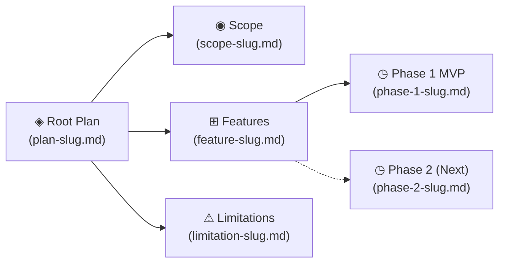
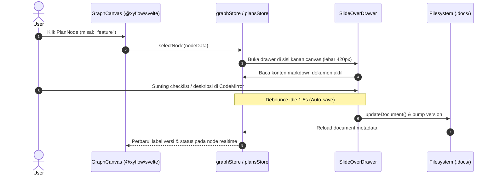

# Phase 2: Node Graph View — Feature & Technical Architecture

## 1. Component Architecture

```
apps/desktop/src/lib/components/
├── graph/
│   ├── GraphCanvas.svelte       ← Main SvelteFlow container, controls, & minimap
│   ├── PlanNode.svelte          ← Custom node component (200px, icon, status, handles)
│   ├── SlideOverDrawer.svelte   ← Side panel inspector with preview & quick editor
│   └── GraphToolbar.svelte      ← Fit view, layout reset, zoom indicators
└── layout/
    └── Header.svelte            ← View mode toggle [📄 Docs / ◈ Graph]
```

---

## 2. State & Data Models

### A. Graph Node Interface (`apps/desktop/src/lib/types/graph.ts`)
```typescript
import type { Node, Edge } from '@xyflow/svelte';
import type { DocType, PlanStatus } from '@plannic/core';

export interface PlanNodeData {
  slug: string;
  docType: DocType;
  title: string;
  status: PlanStatus;
  version: string;
  lastUpdated: string;
  filename: string;
  path: string;
}

export type PlanFlowNode = Node<PlanNodeData, 'planNode'>;
export type PlanFlowEdge = Edge;
```

### B. Graph Store (`apps/desktop/src/lib/stores/graph.svelte.ts`)
```typescript
export class GraphStore {
  selectedNode = $state<PlanNodeData | null>(null);
  drawerOpen = $state(false);
  viewMode = $state<'documents' | 'graph'>('documents');
  nodes = $state<PlanFlowNode[]>([]);
  edges = $state<PlanFlowEdge[]>([]);

  // Generator tree dari Plan object aktif
  buildFromPlan(plan: Plan): void;
  selectNode(data: PlanNodeData): void;
  closeDrawer(): void;
  toggleViewMode(): void;
}
```

---

## 3. Deterministic Auto-Layout Topology

Pohon relasi dihitung secara terstruktur dari objek `Plan.documents`:



### Koordinat Spasial Default:
- **Level 0 (Root Plan)**: `X: 60px, Y: 220px`
- **Level 1 (Specifications)**: `X: 360px`
  - Scope: `Y: 60px`
  - Features: `Y: 220px`
  - Limitations: `Y: 380px`
- **Level 2 (Execution / Phases)**: `X: 660px`
  - Phase 1: `Y: 140px`
  - Phase 2+: `Y: 300px` (dinamis per phase)

---

## 4. Node Anatomy & Interactions

### Custom Node (`PlanNode.svelte`)
- **Width**: `200px`, `height: auto`
- **Handles**: 
  - `Position.Left` (Target handle) — tersembunyi kecuali saat edge terkoneksi.
  - `Position.Right` (Source handle) — tersembunyi kecuali saat edge keluar.
- **Header**: Ikon tipe dokumen + Nama slug dokumen (`--font-mono`, `--text-sm`).
- **Footer**: Status badge (`Draft`, `In Progress`, `Complete`) + Nomor versi (`v1.2`).
- **Styling Tokens**:
  - Background: `var(--base-surface)`
  - Border: `1px solid var(--base-border)`
  - Selected: `1px solid var(--accent)` + glow `0 0 12px rgba(91, 107, 248, 0.25)`

---

## 5. Slide-Over Drawer Interaction Flow



---

## 6. Keyboard & Canvas Controls
- `Ctrl+G` / `Cmd+G`: Toggle antara Document View & Graph View.
- `Escape`: Menutup Slide-over Drawer jika sedang terbuka.
- `Space + Drag`: Panning kanvas tanpa menggeser node.
- `F`: Fit view (fokuskan kanvas ke seluruh node tree).
