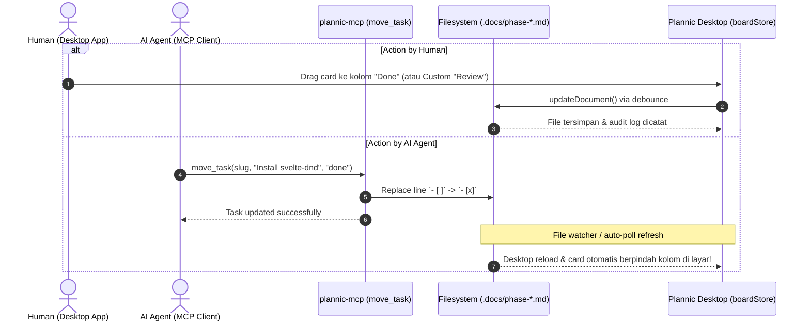

# Phase 3: Interactive Kanban Board — Feature & Technical Architecture

## 1. Component & Package Architecture

```
apps/
├── mcp-server/src/tools/
│   └── move-task.ts             ← Tool MCP baru: move_task (untuk AI agent)
└── desktop/src/lib/
    ├── components/board/
    │   ├── KanbanBoard.svelte   ← Main Board container (dynamic column flex layout)
    │   ├── KanbanColumn.svelte  ← Droppable column container (svelte-dnd-action)
    │   ├── KanbanCard.svelte    ← Draggable task card (title, origin tag, direct checkbox)
    │   ├── AddColumnModal.svelte← Modal create custom column
    │   ├── NewTaskModal.svelte  ← Modal tambah task baru
    │   └── BoardToolbar.svelte  ← Phase filter, Single/Global switch, "+ Column" button
    └── stores/
        └── board.svelte.ts      ← State management, custom columns, regex parser & serializer
```

---

## 2. Data Models (`apps/desktop/src/lib/types/board.ts`)

```typescript
export type BuiltInTaskStatus = 'todo' | 'in_progress' | 'done';
export type TaskStatus = BuiltInTaskStatus | string;

export interface KanbanTask {
  id: string;             // Unique identifier (planSlug:phaseSlug:lineIndex)
  planSlug: string;       // Slug plan pemilik task
  phaseSlug: string;      // Slug phase document asal
  phaseTitle: string;     // Nama human-readable phase
  title: string;          // Teks deskripsi task
  status: TaskStatus;     // 'todo' | 'in_progress' | 'done' | string (custom)
  lineIndex: number;      // Indeks baris asli pada markdown body
  rawLine: string;        // String baris asli sebelum dimodifikasi
  subItems?: string[];    // Sub-bullet point jika ada
}

export interface KanbanColumnData {
  id: string;             // 'todo' | 'in_progress' | 'done' | 'review' | etc.
  title: string;          // Display title ('Todo', 'In Progress', 'Done', 'Review')
  isCustom?: boolean;     // True jika kolom kustom buatan user
  color?: string;         // Accent color opsional
  items: KanbanTask[];
}
```

---

## 3. MCP Tool Specification: `move_task` (Untuk AI Agents)

AI agent dapat memindahkan status task kapan saja tanpa GUI:

### Input Schema (`MoveTaskInputSchema`)
```typescript
{
  cwd: string;            // Absolute path ke project folder
  slug: string;           // Slug plan (misal: "phase-3-interactive-kanban-board")
  phaseSlug?: string;     // Opsional: spesifik phase doc ("phase-1" atau null untuk auto-search)
  taskIdentifier: string; // Bisa berupa task id, lineIndex, atau substring judul task
  newStatus: string;      // 'todo' | 'in_progress' | 'done' | atau custom status id
  comment?: string;       // Catatan opsional yang disimpan ke audit trail
}
```

### Eksekusi di `@plannic/fs`:
1. Baca file markdown target di `.docs/`.
2. Temukan baris checklist yang cocok dengan `taskIdentifier`.
3. Ganti penanda checkbox:
   - `'todo'` -> `- [ ]`
   - `'in_progress'` -> `- [/]`
   - `'done'` -> `- [x]`
   - Custom (`'review'`) -> `- [review]`
4. Tulis kembali ke disk dengan bump version dan catat ke `.docs/.history/plan-<slug>.jsonl`.

---

## 4. Custom Columns Parsing & Serialization

Regex parser mendukung karakter CommonMark standar dan custom string identifier:

```typescript
// Regex yang menangkap [ ], [/], [x], atau [custom_id]
const CHECKLIST_REGEX = /^\s*-\s*\[([a-zA-Z0-9_\-\/ ]*)\]\s*(.+)$/;

function parseStatus(marker: string): TaskStatus {
  const trimmed = marker.trim().toLowerCase();
  if (trimmed === '' || trimmed === ' ') return 'todo';
  if (trimmed === '/' || trimmed === 'wip') return 'in_progress';
  if (trimmed === 'x') return 'done';
  return trimmed; // Mengembalikan identifier custom (misal: 'review', 'qa', 'blocked')
}

function serializeMarker(status: TaskStatus): string {
  if (status === 'todo') return ' ';
  if (status === 'in_progress') return '/';
  if (status === 'done') return 'x';
  return status; // Menuliskan [- [custom_id] Task]
}
```

---

## 5. Sequence Diagram: Dual-Actor Sync Flow (Human & AI)


