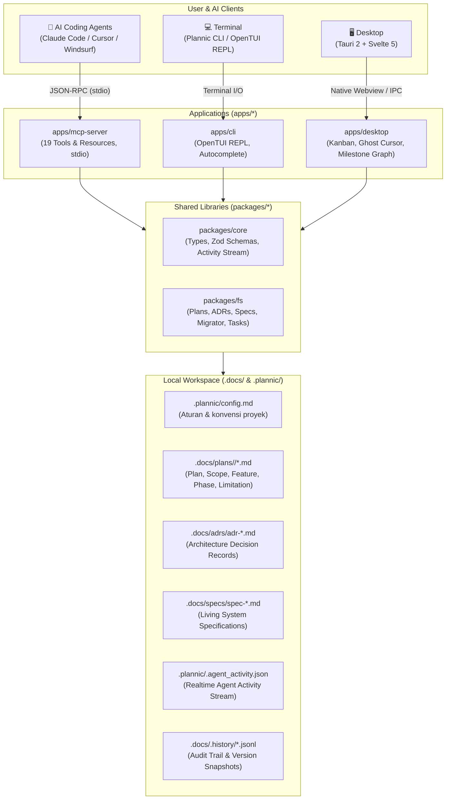
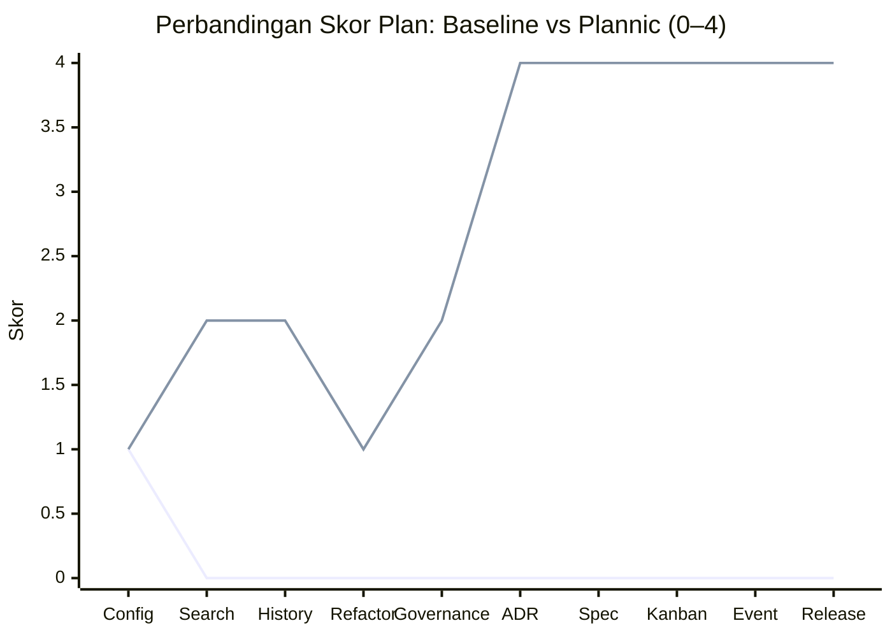

<p align="center">
  <a href="https://github.com/JustALearner101/Plannic">
    
  </a>
</p>

<p align="center">
  <strong>Local-first planning workbench untuk solo developer yang lelah dengan AI agent yang mudah lupa.</strong>
</p>

<p align="center">
  <strong>Bahasa Indonesia</strong> | <a href="README.md">English</a>
</p>

<p align="center">
  <a href="https://github.com/JustALearner101/Plannic/releases"></a>
  <a href="https://bun.sh/"></a>
  <a href="https://tauri.app/"></a>
  <a href="https://svelte.dev/"></a>
  <a href="https://modelcontextprotocol.io/"></a>
  
  <a href="./LICENSE"></a>
</p>

```text
  ██████╗ ██╗      █████╗ ███╗   ██╗███╗   ██╗██╗ ██████╗
  ██╔══██╗██║     ██╔══██╗████╗  ██║████╗  ██║██║██╔════╝
  ██████╔╝██║     ███████║██╔██╗ ██║██╔██╗ ██║██║██║
  ██╔═══╝ ██║     ██╔══██║██║╚██╗██║██║╚██╗██║██║██║
  ██║     ███████╗██║  ██║██║ ╚████║██║ ╚████║██║╚██████╗
  ╚═╝     ╚══════╝╚═╝  ╚═╝╚═╝  ╚═══╝╚═╝  ╚═══╝╚═╝ ╚═════╝
  PLANNIC / Architecture, Living Specs & Planning Workbench v0.3.1
```

---

## Apa ini?

AI coding agent sangat andal dalam menulis kode. Tapi mereka sangat buruk dalam *mengingat* kenapa sebuah keputusan arsitektur dibuat dua minggu lalu, apa batas scope untuk sprint ini, atau trade-off apa yang sudah ditolak sebelumnya.

**Plannic** memberi agent memori terstruktur — file Markdown lokal di bawah `.docs/` yang bisa dibaca dan ditulis lewat server MCP dengan 19 tools. Rencana kerja (plans), ADR, living spec, dan task phase semuanya hidup di dalam repo Anda, berversi bersama kode, tanpa perlu cloud.

Plannic hadir dengan desktop app berbasis Tauri 2 (Kanban board, grafik dependensi milestone, ghost cursor yang menampilkan aksi agent secara real-time) dan OpenTUI CLI jika Anda lebih suka tetap berada di terminal.

> 🤖 **AI agent?** Lihat [AGENT_GUIDE.md](./AGENT_GUIDE.md) untuk runbook onboarding instan dan referensi lengkap tool MCP.

---

## Instalasi

### macOS & Linux
> ℹ️ **Catatan**: Binary POSIX pra-kompilasi sedang disiapkan untuk rilis tag `v0.3.2`. Untuk menjalankan di macOS/Linux saat ini, instal melalui [Dari source](#dari-source).
```bash
curl -fsSL https://raw.githubusercontent.com/JustALearner101/Plannic/main/scripts/install.sh | sh
```

### Windows (PowerShell)
```powershell
irm https://raw.githubusercontent.com/JustALearner101/Plannic/main/scripts/install.ps1 | iex
```

### Validasi & Inisialisasi Workspace
```bash
plannic doctor          # periksa lingkungan sistem & kesehatan server MCP
plannic doctor --mcp    # mencakup uji handshake live stdio MCP
plannic init            # scaffold .docs/, .plannic/config.md, dan skills agent
plannic init --diff     # pratinjau perubahan tanpa menimpa file yang ada
```

### Dari source
```bash
git clone https://github.com/JustALearner101/Plannic.git
cd Plannic
bun install
```

---

## Panduan Cepat

```bash
# TUI Interaktif
bun run plan

# Perintah Langsung (CLI)
bun run plan list
bun run plan search "auth"
bun run plan create "Payment Gateway" --mode deep

# Desktop App (Tauri, hot reload)
bun run dev:desktop

# Svelte dev server khusus browser (port 5173)
bun run dev:web

# Server MCP
bun run dev:mcp
```

---

## Hubungkan ke AI Assistant

Tambahkan konfigurasi berikut ke `.mcp.json` di Claude Code, Cursor, Windsurf, atau Roo Code:

```json
{
  "mcpServers": {
    "plannic": {
      "command": "plannic",
      "args": ["mcp"]
    }
  }
}
```

Selesai. AI agent Anda sekarang memiliki akses langsung ke seluruh 19 tool perencanaan Plannic.

---

## Cara Kerja

Plannic memiliki tiga antarmuka yang membaca dan menulis ke file lokal yang sama:



Agent memanggil tool MCP → Plannic menulis ke `.docs/` → aplikasi desktop memperbarui tampilan secara real-time. Semuanya berupa file Markdown murni. Tidak ada data yang keluar dari mesin Anda.

---

## Fitur

### 🤖 19 MCP Tools

Agent Anda mendapatkan akses baca/tulis terstruktur ke seluruh domain perencanaan — tanpa prompt hack, tanpa kebingungan mencari path file.

| Kelompok | Tools |
|---|---|
| **Planning** | `init_plan`, `get_plan`, `update_document`, `list_plans`, `search_plans`, `get_history` |
| **Phases & Tasks** | `move_task`, `add_phase`, `advance_phase`, `get_execution_progress` |
| **ADRs** | `init_adr`, `get_adr`, `list_adrs` |
| **Specs** | `init_spec`, `get_spec`, `update_spec`, `list_specs` |
| **Config & Migration** | `get_config`, `migrate_plan` |

Agent biasanya memulai sesi dengan memanggil `get_config` (membaca `.plannic/config.md`) dan `list_adrs` sebelum menyentuh file apa pun — sehingga agent langsung mengetahui aturan dan keputusan arsitektur yang berlaku.

---

### 📋 Architecture Decision Records (ADR) Engine

Hentikan debat berulang untuk keputusan yang sama. Setiap keputusan penting — database mana, pola apa, batasan apa — dicatat di `.docs/adrs/` dengan lifecycle status:

```
proposed → accepted → superseded
                    ↘ rejected
```

Agent membaca catatan ini sebelum merancang solusi. Agent tidak akan menyarankan pola yang sudah Anda tolak.

---

### 📐 Living Specifications

Kontrak modul, data model, spesifikasi API — semuanya tersimpan di `.docs/specs/`. Otomatis menerapkan semantic versioning + audit trail append-only pada setiap pembaruan.

Agent memanggil `get_spec` sebelum mengubah modul. Agent tahu kontraknya secara pasti, tanpa menebak-nebak.

---

### 🗂️ Hierarchical Plans

Satu rencana kerja = satu folder terisolasi. Tidak ada lagi dokumen PRD raksasa yang menjadi tumpukan teks sulit dibaca.

```
.docs/plans/payment-gateway/
├── plan.md        ← ringkasan eksekutif, status, indeks dokumen
├── scope.md       ← apa yang masuk scope, apa yang secara eksplisit di luar scope
├── feature.md     ← rincian fungsional + acceptance criteria
├── phase-1.md     ← tugas milestone dengan checklist markdown
└── limitation.md  ← trade-off teknis dan edge cases yang diketahui
```

Tersedia migrasi otomatis dari dokumen flat lama: `bun run migrate-docs`.

---

### ⚙️ Konfigurasi Per-Project

File `.plannic/config.md` mengendalikan perilaku Plannic di setiap repositori. Agent membaca file ini terlebih dahulu melalui `get_config`.

```yaml
---
project: my-app
stack: [Next.js, PostgreSQL, TypeScript]
default_mode: deep
lang: id
generated_docs:
  - type: plan
    filename: plan.md
    required: true
  - type: scope
    filename: scope.md
    required: true
  - type: phase
    filename: phase-1.md
    required: true
ruleset:
  strict_kanban: true
  auto_changelog: true
  max_phases_recommended: 5
  enforce_feedback_artifact: true
---

## Context
Penjelasan tentang proyek ini, siapa penggunanya, konvensi teknis, dan apa pun
yang wajib dipahami agent sebelum menyentuh codebase.
```

Proyek berbeda, konfigurasi berbeda. Agent beradaptasi secara otomatis.

> 📖 **Jelajahi dokumentasi teknis lengkap:**
> - [⚙️ Configuration Reference (`docs/config-reference.md`)](./docs/config-reference.md)
> - [🏛️ System Architecture (`docs/architecture.md`)](./docs/architecture.md)
> - [🔧 Internal Mechanics & Logic Guide (`docs/internal-mechanics.md`)](./docs/internal-mechanics.md)

---

### 👻 Ghost Cursor & Ambient HUD

Aplikasi desktop Tauri menampilkan apa yang sedang dikerjakan agent Anda — secara langsung (real-time).

- **Ambient border**: perimeter jendela desktop menyala cyan (`#38bdf8`) ketika tool MCP sedang dieksekusi
- **Ghost cursor**: kursor AI semi-transparan melayang di atas Kanban board, mengikuti kartu atau dokumen yang sedang disentuh agent
- **Activity HUD**: pesan status langsung di header seperti *"Memindahkan task ke In Progress..."*

Semua ditenagai oleh event stream `.plannic/.agent_activity.json` dengan penulisan file atomik, tanpa jeda polling.

---

### ⊞ Kanban Board & Milestone Graph

Drag-and-drop kartu tugas antar kolom status `todo → in_progress → done` (atau kolom kustom). Tampilan papan board tersinkronisasi instan saat agent memanggil `move_task` atau `advance_phase` — tanpa perlu refresh manual.

**Milestone Graph** memvisualisasikan dependensi antar fase implementasi dengan progress bar animasi.

---

### 🔄 Auto-Updater

Pembaruan satu klik di dalam aplikasi desktop. Didukung oleh Tauri 2 + GitHub Releases + tanda tangan digital Minisign. Tidak perlu instal ulang manual.

---

## Arsitektur

```text
Plannic/
├── packages/
│   ├── core/       # Shared Zod schemas, TypeScript types, konstanta path
│   └── fs/         # Filesystem engine — plans, ADRs, specs, tasks, migrator
├── apps/
│   ├── desktop/    # Tauri 2 + Svelte 5 — Kanban, Ghost Cursor, Milestone Graph
│   ├── mcp-server/ # Server MCP stdio — 19 tools & resources
│   └── cli/        # Antarmuka terminal OpenTUI
├── .docs/          # Sistem pencatatan perencanaan Anda (tercatat di Git)
├── .plannic/       # Konfigurasi workspace + stream aktivitas agent
├── e2e/            # Runner E2E 7-suite (Playwright + stability benchmark)
└── .github/workflows/  # CI: typecheck → test → build → release
```

---

## Pengujian

```bash
# Typecheck statis (TypeScript + Svelte)
bun run typecheck

# Unit tests (5 suites: core, fs, mcp-server)
bun run test:all

# Benchmark E2E & stabilitas (7 suites, Playwright headless)
bun run test:e2e
```

---

## Benchmark: Apakah konteks terstruktur benar-benar membantu?

Plannic dibangun atas dasar keyakinan bahwa AI agent merencanakan solusi secara signifikan lebih baik saat memiliki jangkar konteks eksplisit — batasan scope, keputusan ADR yang disetujui, dan kontrak modul yang jelas — daripada harus menebak seluruh arsitektur dari source code mentah.

Berikut hasil pengujian paired benchmark pada **10 inisiatif arsitektur** (total 20 eksekusi terisolasi), membandingkan prompt identik dengan dan tanpa Plannic:



| Task | Baseline | Plannic | Peningkatan |
|---|---:|---:|---:|
| Validasi config | 1/4 | 1/4 | 0 |
| Search lintas module | 0/4 | 2/4 | **+2** |
| Ringkasan API history | 0/4 | 2/4 | **+2** |
| Refactor task parser | 0/4 | 1/4 | **+1** |
| Metadata tata kelola plan | 0/4 | 2/4 | **+2** |
| Lineage superseding ADR | 0/4 | 4/4 | **+4** |
| Sinkronisasi living spec | 0/4 | 4/4 | **+4** |
| Rollback fase sequential | 0/4 | 4/4 | **+4** |
| Filter activity event stream | 0/4 | 4/4 | **+4** |
| Verifikasi rilis POSIX | 0/4 | 4/4 | **+4** |
| **Rata-rata Skor Plan** | **0.1/4** | **2.8/4** | **+2.7** |

> *Catatan metodologi:* Penilaian skor menggunakan pencocokan kata kunci dan path berkas. Solusi yang ekuivalen secara semantik namun menggunakan terminologi berbeda dapat memperoleh skor lebih rendah dari yang seharusnya.

**Kesimpulan Utama:** Plannic meraih **90% win rate** (9 dari 10 task), dengan peningkatan tertinggi terlihat pada pengelolaan ADR, sinkronisasi living specification, dan alur kerja lintas paket — area di mana LLM tanpa jangkar arsitektur kerap berhalusinasi atau melewatkan aturan penting.

Jalankan sendiri secara lokal: `bun run benchmark:planning`. Metodologi lengkap dan raw log tersedia di [`benchmarks/planning/VALID-RUN-RESULTS.md`](./benchmarks/planning/VALID-RUN-RESULTS.md).

---

## Rilis

```bash
# Bump versi di seluruh monorepo (tauri.conf.json, Cargo.toml, seluruh package.json)
bun run bump patch    # 0.3.1 → 0.3.2
bun run bump minor    # 0.3.1 → 0.4.0
bun run bump 0.4.2    # versi spesifik

# Tag dan push — CI menangani sisanya
git commit -am "chore: release v0.3.2"
git tag v0.3.2
git push origin main --tags
```

Pipeline CI: typecheck → test → build installer Windows `.exe` + `.msi` → tandatangani dengan Minisign → publikasikan ke GitHub Releases.

---

## Desain

Plannic menganut estetika **Monochrome Workshop**: palet gelap (`#0F1117`), border 1px presisi, nol ornamen dekorasi berlebih, nol ketergantungan cloud. Jika sebuah fitur tidak benar-benar penting, fitur itu tidak akan dimasukkan.

---

## Lisensi

MIT © [JustALearner101 / Atar](https://github.com/JustALearner101/Plannic)
