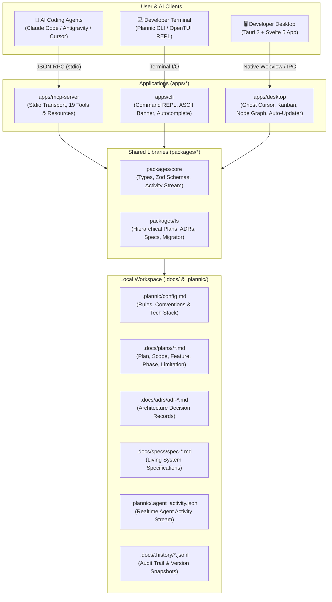
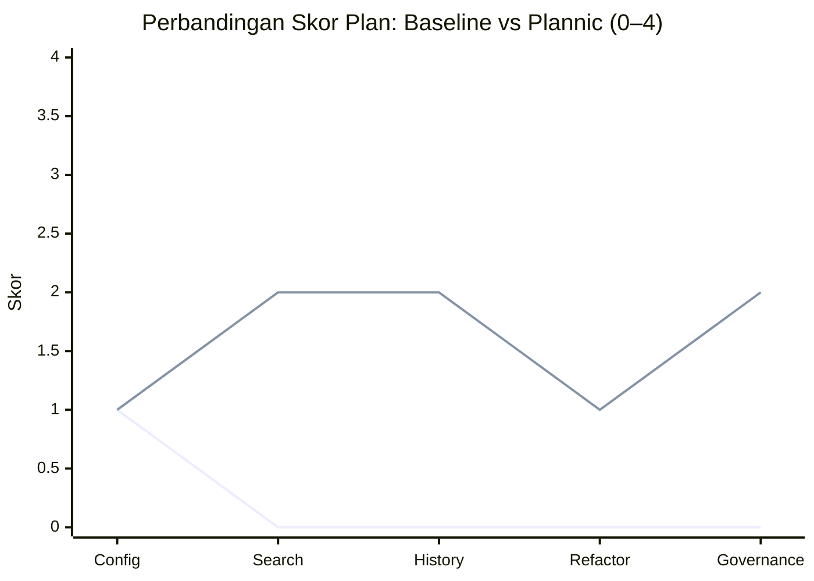

<p align="center">
  <a href="https://github.com/JustALearner101/Plannic">
    
  </a>
</p>

<p align="center">
  <strong>Structured Architecture, Living Specs &amp; Strategic Planning Workbench for Solo Developers &amp; AI Coding Agents</strong>
</p>

<p align="center">
  <strong>Bahasa Indonesia</strong> | <a href="README.md">English</a>
</p>

<p align="center">
  <a href="https://github.com/JustALearner101/Plannic/releases"></a>
  <a href="https://bun.sh/"></a>
  <a href="https://tauri.app/"></a>
  <a href="https://svelte.dev/"></a>
  <a href="https://github.com/anomalyco/opentui"></a>
  <a href="https://modelcontextprotocol.io/"></a>
  
  <a href="./LICENSE"></a>
</p>

```text
  ██████╗ ██╗      █████╗ ███╗   ██╗███╗   ██╗██╗ ██████╗
  ██╔══██╗██║     ██╔══██╗████╗  ██║████╗  ██║██║██╔════╝
  ██████╔╝██║     ███████║██╔██╗ ██║██╔██╗ ██║██║██║     
  ██╔═══╝ ██║     ██╔══██║██║╚██╗██║██║╚██╗██║██║██║     
  ██║     ███████╗██║  ██║██║ ╚████║██║ ╚████║██║╚██████╗
  ╚═╝     ╚══════╝╚═╝  ╚═╝╚═╝  ╚═══╝╚═╝  ╚═══╝╚═╝ ╚═════╝
  PLANNIC / Architecture, Living Specs & Planning Workbench v0.3.0
```

---

Plannic adalah **local-first engineering workbench** yang menjembatani developer dan AI coding agents (*Claude Code, Antigravity, Cursor, Windsurf, Roo Code*) di atas satu sistem kebenaran universal (*single source of truth*) dalam format Markdown lokal di `.docs/`.

Didesain dengan filosofi **Monochrome Workshop**: bersih, performan tinggi, palet warna workshop gelap (`#0F1117`), border 1px presisi, dan nol ketergantungan cloud database.

> 🤖 **Bekerja dengan AI Coding Assistant?** Lihat [AGENT_GUIDE.md](./AGENT_GUIDE.md) untuk panduan runbook onboarding instan, referensi MCP tools, pedoman pengujian, dan workflow rilis otomatis.

---

## 🚀 Instalasi

### Headless / AI Agent

```bash
curl -fsSL https://raw.githubusercontent.com/JustALearner101/Plannic/main/scripts/install-headless.sh | sh
```

Di Windows PowerShell:

```powershell
irm https://raw.githubusercontent.com/JustALearner101/Plannic/main/scripts/install-headless.ps1 | iex
```

### Dari Source

```bash
git clone https://github.com/JustALearner101/Plannic.git
cd Plannic
bun install
```

Lihat [Panduan Memulai](#-panduan-memulai) untuk perintah development CLI, desktop, dan MCP.

---

## 🏛️ Arsitektur Sistem

Plannic mengoperasikan arsitektur multi-tier di mana AI coding agent, aplikasi desktop, dan terminal CLI beroperasi secara real-time di atas penyimpanan dokumen lokal:



---

## ✨ Fitur & Kapabilitas Utama

### 1. 👻 Realtime Agent Ghost Cursor & Ambient HUD
- **Ambient Glowing Border**: Saat AI agent memanggil MCP tool di terminal atau editor, batas desktop Plannic berpendar biru cyan (`#38bdf8`) menandakan agent sedang aktif merancang atau memodifikasi file.
- **Ghost Cursor**: Kursor transparan agen AI melayang di atas Kanban board dan dokumen dengan badge nama agen, menampilkan kartu/tugas apa yang sedang disentuh atau dipindahkan secara real-time.
- **Top HUD Status**: Menampilkan pesan aktivitas agen secara ringkas di header (*"Moving task to In Progress..."*).

### 2. 📋 Architecture Decision Records (ADR) Engine
- Dokumentasikan keputusan arsitektur penting secara formal di `.docs/adrs/`.
- Lifecycle status standar: `proposed`, `accepted`, `rejected`, `superseded`.
- Integrasi penuh dengan MCP tool (`init_adr`, `get_adr`, `list_adrs`) dan skill Antigravity `/adr`.

### 3. 📐 Living Specifications & System Contracts Engine
- Pertahankan kontrak modul, format data, dan spesifikasi API di `.docs/specs/`.
- Menyediakan riwayat versi dan snapshot audit trail.
- Didukung oleh tool MCP (`init_spec`, `get_spec`, `update_spec`, `list_specs`) dan skill `/spec`.

### 4. 🗂️ Hierarchical Multi-Document Plans
- Rencana proyek tersimpan rapi dalam folder mandiri `.docs/plans/<slug>/`:
  - `plan.md`: Ringkasan eksekutif, status, dan indeks dokumen.
  - `scope.md`: Batasan eksplisit in-scope & out-of-scope.
  - `feature.md`: Rincian fitur fungsional & acceptance criteria.
  - `phase-*.md`: Roadmap deliverable dengan checklist task interaktif.
  - `limitation.md`: Batasan teknis, edge case, dan technical debt.
- Dilengkapi migrator otomatis dari format flat legacy (`bun run migrate-docs`).

### 5. ⊞ Interactive Kanban Board & Milestone Graph
- Visualisasi status task per-fase (`todo`, `in_progress`, `done`, atau custom column) dengan drag-and-drop.
- **Milestone Graph**: Visualisasi rantai dependensi antar-fase dan progress bar persentase penyelesaian task.
- Sinkronisasi instan dua arah antara UI desktop dan perubahan yang dibuat agen via `move_task` atau `advance_phase`.

### 6. 🔄 In-App Zero-Touch Auto-Updater
- Didukung oleh `@tauri-apps/plugin-updater` dan GitHub Releases.
- Notifikasi floating toast dark workshop dengan deteksi versi otomatis saat aplikasi dijalankan.
- Tampilan catatan rilis (*release notes*), *progress bar* download byte real-time, dan tombol **"Update & Restart"** sekali klik.
- Paket update ditandatangani secara kriptografis menggunakan Minisign (`.sig`).

### 7. 🤖 Model Context Protocol (MCP) Server
- Menyediakan 19 tools & resources terstandarisasi untuk LLM:
  - Planning: `init_plan`, `get_plan`, `update_document`, `list_plans`, `search_plans`, `get_history`
  - Phases & Tasks: `move_task`, `add_phase`, `advance_phase`, `get_execution_progress`
  - ADRs: `init_adr`, `get_adr`, `list_adrs`
  - Specs: `init_spec`, `get_spec`, `update_spec`, `list_specs`
  - Migration & Config: `get_config`, `migrate_plan`

### 8. ⌨️ OpenTUI Terminal Workbench
- TUI interaktif dengan navigasi keyboard, tab autocomplete, dan palette perintah (`Ctrl+K`).
- ASCII art banner berdesain retro modern.
- Menjalankan perintah non-interaktif langsung dari command-line terminal (`plan list`, `plan search`, `plan create`).

---

## 📦 Struktur Monorepo

```text
Plannic/
├── packages/
│   ├── core/                  # Shared Zod schemas, TypeScript types, paths & activity schemas
│   └── fs/                    # Filesystem engine (Hierarchical docs, ADRs, Specs, Migrator, Tasks)
├── apps/
│   ├── desktop/               # Tauri 2 + Svelte 5 visual workbench (Kanban, Ghost Cursor, Updater)
│   ├── mcp-server/            # stdio MCP server (19 planning, ADR & spec tools)
│   └── cli/                   # OpenTUI-powered interactive terminal interface
├── .docs/                     # Universal Architecture & Planning system of record
│   ├── plans/<slug>/          # Hierarchical multi-document plans
│   ├── adrs/                  # Architecture Decision Records
│   └── specs/                 # Living system specifications & API contracts
├── .plannic/                  # Workspace configuration (.plannic/config.md) & activity stream
├── .github/workflows/         # CI/CD pipelines (e2e.yml, release.yml)
├── e2e/                       # 7-Suite Unified E2E, Playwright & Stability Benchmark Runner
├── scripts/                   # Helper scripts (version bump, migrations)
└── release/                   # Distribution binaries (.exe installer, standalone app & mcp binary)
```

---

## 🚀 Panduan Memulai

### Prasyarat
- [Bun](https://bun.sh/) >= 1.2
- [Rust & Cargo](https://rustup.rs/) (Khusus jika ingin mem-build desktop app secara lokal)

### 1. Install Dependencies
```bash
bun install
```

### 2. Jalankan Terminal CLI
```bash
# Buka mode TUI interaktif:
bun run plan

# Atau perintah langsung (non-interaktif):
bun run plan list
bun run plan search "auth"
bun run plan create "Payment Gateway" --mode deep
```

### 3. Jalankan Aplikasi Desktop
```bash
# Mode desktop native (Tauri 2 hot-reload):
bun run dev:desktop

# Mode web browser (Vite dev server di port 5173):
bun run dev:web
```

### 4. Jalankan MCP Server
```bash
bun run dev:mcp
```

---

## 🔌 Setup MCP Client (AI Assistant)

Tambahkan konfigurasi berikut ke AI editor Anda (`.mcp.json` di Antigravity, Claude Code, atau Cursor):

```json
{
  "mcpServers": {
    "plannic": {
      "command": "bun",
      "args": ["run", "D:/Project/Plannic/apps/mcp-server/src/index.ts"]
    }
  }
}
```

*Atau menggunakan binary mandiri precompiled (`release/plannic-mcp.exe`):*
```json
{
  "mcpServers": {
    "plannic": {
      "command": "D:/Project/Plannic/release/plannic-mcp.exe"
    }
  }
}
```

---

## 🏷️ Versioning & Automated Releases

Plannic mengikuti aturan **Semantic Versioning** (`vMAJOR.MINOR.PATCH`).

### 1. Bumping Versi (Satu Perintah)
```bash
# Patch (0.3.0 -> 0.3.1)
bun run bump patch

# Minor (0.3.0 -> 0.4.0)
bun run bump minor

# Versi spesifik
bun run bump 0.3.5
```
*(Otomatis mensinkronkan `tauri.conf.json`, `Cargo.toml`, dan semua manifest `package.json`).*

### 2. Memicu Rilis CI/CD Otomatis
```bash
git commit -am "chore: release v0.2.1"
git tag v0.2.1
git push origin main --tags
```
Pipeline [`.github/workflows/release.yml`](./.github/workflows/release.yml) akan otomatis memvalidasi pengujian, mem-build installer Windows (`.exe` NSIS & `.msi`), menandatangani paket update, dan mempublikasikannya ke GitHub Releases.

---

## 🧪 Quality Assurance & Testing Suite

Seluruh ekosistem Plannic divalidasi dengan rangkaian pengujian komprehensif:

```bash
# 1. Monorepo static typecheck (TypeScript & Svelte):
bun run typecheck

# 2. Unit tests (packages/core, packages/fs, apps/mcp-server):
bun run test:all

# 3. 7-Suite Unified E2E & Stability Runner (termasuk Playwright headless browser):
bun run test:e2e
```

## 📊 Benchmark Planning: Plan Lebih Baik, Lebih Sedikit Tebak-tebakan

Plannic dibuat untuk mengatasi kelemahan umum planning bawaan AI agent: plan terdengar masuk akal, tetapi sering melewatkan boundary repository, dependency, dan keputusan arsitektur.

Benchmark paired pertama membandingkan lima task yang sama dengan dan tanpa structured planning tools dari Plannic:



`Garis 1 = plan baseline` · `Garis 2 = plan dengan Plannic`

| Task | Baseline | Plannic |
|---|---:|---:|
| Validasi config | 1/4 | 1/4 |
| Search lintas module | 0/4 | 2/4 |
| API history | 0/4 | 2/4 |
| Refactor task parser | 0/4 | 1/4 |
| Governance plan | 0/4 | 2/4 |

| Agregat | Baseline | Plannic | Perubahan |
|---|---:|---:|---:|
| Rata-rata skor plan | 0.2/4 | 1.6/4 | **+1.4** |

**Sinyal:** peningkatan terkuat Plannic terlihat pada task lintas module dan berat di arsitektur—tepat pada kasus ketika agent membutuhkan context, keputusan, dan boundary eksekusi yang eksplisit.

Sinyal awalnya: Plannic menghasilkan plan yang lebih kuat pada 3 dari 5 task berorientasi arsitektur, serta menyamai atau memperbaiki 2 task lainnya. Ini masih hasil awal validasi harness—belum klaim peningkatan implementasi. Tahap berikutnya memakai paired implementation patch nyata untuk mengukur test success, scope drift, dan effort koreksi.

Jalankan secara lokal dengan `bun run benchmark:planning`. Metodologi dan hasil lengkap tersedia di [`benchmarks/planning/VALID-RUN-RESULTS.md`](./benchmarks/planning/VALID-RUN-RESULTS.md).

---

### Instalasi mode headless

Untuk AI agent, CI, dan automation tanpa UI. Installer mendukung Linux/macOS x64 dan ARM64, serta Windows x64. Semua artifact diverifikasi dengan SHA-256.

```sh
curl -fsSL https://raw.githubusercontent.com/JustALearner101/Plannic/main/scripts/install-headless.sh | sh
```

Untuk Windows PowerShell:

```powershell
irm https://raw.githubusercontent.com/JustALearner101/Plannic/main/scripts/install-headless.ps1 | iex
```

Gunakan `PLANNIC_REPO` atau `PLANNIC_INSTALL_DIR` untuk mengubah default.

Setelah instalasi, buka terminal baru dan verifikasi dengan:

```text
plannic --help
```

Command `plannic` dan `plannic-headless` tersedia; di Windows installer otomatis menambahkan folder instalasi ke User `PATH`.

## 📄 Lisensi
MIT © [JustALearner101 / Atar](https://github.com/JustALearner101/Plannic)
