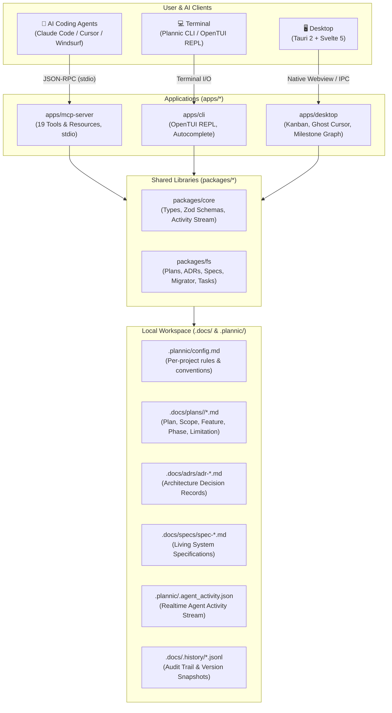
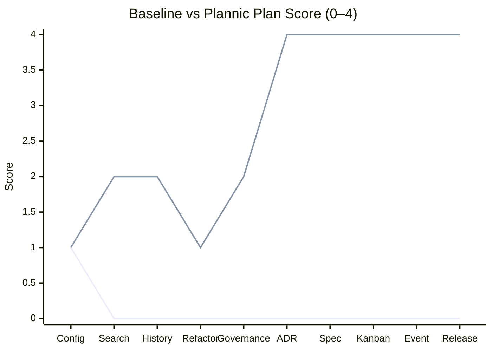

<p align="center">
  <a href="https://github.com/JustALearner101/Plannic">
    
  </a>
</p>

<p align="center">
  <strong>A local-first planning workbench for solo devs tired of AI agents that forget everything.</strong>
</p>

<p align="center">
  <strong>English</strong> | <a href="README.id.md">Bahasa Indonesia</a>
</p>

<p align="center">
  <a href="https://github.com/JustALearner101/Plannic/releases"></a>
  <a href="https://bun.sh/"></a>
  <a href="https://tauri.app/"></a>
  <a href="https://svelte.dev/"></a>
  <a href="https://modelcontextprotocol.io/"></a>
  
  <a href="./LICENSE"></a>
</p>

```text
  ██████╗ ██╗      █████╗ ███╗   ██╗███╗   ██╗██╗ ██████╗
  ██╔══██╗██║     ██╔══██╗████╗  ██║████╗  ██║██║██╔════╝
  ██████╔╝██║     ███████║██╔██╗ ██║██╔██╗ ██║██║██║
  ██╔═══╝ ██║     ██╔══██║██║╚██╗██║██║╚██╗██║██║██║
  ██║     ███████╗██║  ██║██║ ╚████║██║ ╚████║██║╚██████╗
  ╚═╝     ╚══════╝╚═╝  ╚═╝╚═╝  ╚═══╝╚═╝  ╚═══╝╚═╝ ╚═════╝
  PLANNIC / Architecture, Living Specs & Planning Workbench v0.3.1
```

---

## What is this?

AI coding agents are great at writing code. They're terrible at *remembering* why you made a decision two weeks ago, what's in scope for this sprint, or which architectural trade-offs you already ruled out.

**Plannic** gives your agent a structured memory layer — local Markdown files under `.docs/` that it can read and write through a 19-tool MCP server. Plans, ADRs, living specs, and task phases all live in your repo, versioned alongside your code, no cloud required.

It ships with a Tauri 2 desktop app (Kanban board, milestone graph, ghost cursor that shows what your agent is doing in real time) and an OpenTUI CLI for when you'd rather stay in the terminal.

> 🤖 **AI agent?** See [AGENT_GUIDE.md](./AGENT_GUIDE.md) for the zero-shot onboarding runbook and full MCP tool reference.

---

## Install

### macOS & Linux
> ℹ️ **Note**: Precompiled POSIX binaries are rolling out in the upcoming `v0.3.2` release tag. To run on macOS/Linux right now, install via [From source](#from-source).
```bash
curl -fsSL https://raw.githubusercontent.com/JustALearner101/Plannic/main/scripts/install.sh | sh
```

### Windows (PowerShell)
```powershell
irm https://raw.githubusercontent.com/JustALearner101/Plannic/main/scripts/install.ps1 | iex
```

### Verify & init your workspace
```bash
plannic doctor          # check env + MCP server health
plannic doctor --mcp    # includes live stdio handshake test
plannic init            # scaffold .docs/, .plannic/config.md, agent skills
plannic init --diff     # preview changes without overwriting
```

### From source
```bash
git clone https://github.com/JustALearner101/Plannic.git
cd Plannic
bun install
```

---

## Quick Start

```bash
# Interactive TUI
bun run plan

# Direct commands
bun run plan list
bun run plan search "auth"
bun run plan create "Payment Gateway" --mode deep

# Desktop app (Tauri, hot reload)
bun run dev:desktop

# Browser-only Svelte dev server (port 5173)
bun run dev:web

# MCP server
bun run dev:mcp
```

---

## Connect to your AI assistant

Add this to `.mcp.json` in Claude Code, Cursor, Windsurf, or Roo Code:

```json
{
  "mcpServers": {
    "plannic": {
      "command": "plannic",
      "args": ["mcp"]
    }
  }
}
```

That's it. Your agent now has access to all 19 planning tools.

---

## How it works

Plannic has three clients that all read/write the same local files:



The agent calls MCP tools → Plannic writes to `.docs/` → the desktop app picks it up in real time. Everything is plain Markdown. Nothing leaves your machine.

---

## Features

### 🤖 19 MCP Tools

Your agent gets structured read/write access to everything — no prompt hacks, no file path juggling.

| Group | Tools |
|---|---|
| **Planning** | `init_plan`, `get_plan`, `update_document`, `list_plans`, `search_plans`, `get_history` |
| **Phases & Tasks** | `move_task`, `add_phase`, `advance_phase`, `get_execution_progress` |
| **ADRs** | `init_adr`, `get_adr`, `list_adrs` |
| **Specs** | `init_spec`, `get_spec`, `update_spec`, `list_specs` |
| **Config & Migration** | `get_config`, `migrate_plan` |

The agent typically starts a session by calling `get_config` (reads your `.plannic/config.md`) and `list_adrs` before touching anything — so it knows the rules and decisions that are already in place.

---

### 📋 Architecture Decision Records (ADR) Engine

Stop relitigating the same decisions. Every major call — which database, which pattern, which trade-off — gets recorded in `.docs/adrs/` with a lifecycle state:

```
proposed → accepted → superseded
                    ↘ rejected
```

Your agent reads these before planning. It won't suggest something you already ruled out.

---

### 📐 Living Specifications

Module contracts, data models, API specs — all in `.docs/specs/`. Auto semantic versioning + append-only audit trail on every update.

The agent calls `get_spec` before touching a module. It knows the contract. It doesn't guess.

---

### 🗂️ Hierarchical Plans

One plan = one folder. No more single-file PRDs that turn into a wall of text.

```
.docs/plans/payment-gateway/
├── plan.md        ← executive summary, status, doc index
├── scope.md       ← what's in, what's explicitly out
├── feature.md     ← functional breakdown + acceptance criteria
├── phase-1.md     ← milestone tasks with checkboxes
└── limitation.md  ← known trade-offs and edge cases
```

Built-in migration from flat legacy docs: `bun run migrate-docs`.

---

### ⚙️ Per-Project Config

`.plannic/config.md` controls how Plannic behaves for each project. The agent reads this first via `get_config`.

```yaml
---
project: my-app
stack: [Next.js, PostgreSQL, TypeScript]
default_mode: deep
lang: en
generated_docs:
  - type: plan
    filename: plan.md
    required: true
  - type: scope
    filename: scope.md
    required: true
  - type: phase
    filename: phase-1.md
    required: true
ruleset:
  strict_kanban: true
  auto_changelog: true
  max_phases_recommended: 5
  enforce_feedback_artifact: true
---

## Context
What this project is, who it's for, tech conventions, and anything
the agent needs to know before touching the codebase.
```

Different project, different config. The agent adapts automatically.

> 📖 **Explore the complete documentation subsystem:**
> - [⚙️ Configuration Reference (`docs/config-reference.md`)](./docs/config-reference.md)
> - [🏛️ System Architecture (`docs/architecture.md`)](./docs/architecture.md)
> - [🔧 Internal Mechanics & Logic Guide (`docs/internal-mechanics.md`)](./docs/internal-mechanics.md)

---

### 👻 Ghost Cursor & Ambient HUD

The Tauri desktop app shows you exactly what your agent is doing — in real time.

- **Ambient border**: the window perimeter glows cyan (`#38bdf8`) when an MCP tool is executing
- **Ghost cursor**: a semi-transparent AI cursor floats across the Kanban board, following what task or document the agent is touching
- **Activity HUD**: a live header message like *"Moving task to In Progress..."*

All fed from `.plannic/.agent_activity.json` via atomic file writes, zero polling lag.

---

### ⊞ Kanban Board & Milestone Graph

Drag-and-drop task cards across `todo → in_progress → done` (or custom columns). The board syncs instantly when your agent calls `move_task` or `advance_phase` — no refresh needed.

The **Milestone Graph** visualizes cross-phase dependencies with animated progress bars.

---

### 🔄 Auto-Updater

One-click update inside the app. Tauri 2 + GitHub Releases + Minisign signatures. No manual reinstall.

---

## Architecture

```text
Plannic/
├── packages/
│   ├── core/       # Shared Zod schemas, TypeScript types, path constants
│   └── fs/         # Filesystem engine — plans, ADRs, specs, tasks, migrator
├── apps/
│   ├── desktop/    # Tauri 2 + Svelte 5 — Kanban, Ghost Cursor, Milestone Graph
│   ├── mcp-server/ # stdio MCP server — 19 tools & resources
│   └── cli/        # OpenTUI terminal interface
├── .docs/          # Your planning system of record (committed to repo)
├── .plannic/       # Workspace config + agent activity stream
├── e2e/            # 7-suite E2E runner (Playwright + stability benchmarks)
└── .github/workflows/  # CI: typecheck → test → build → release
```

---

## Testing

```bash
# Typecheck (TypeScript + Svelte)
bun run typecheck

# Unit tests (5 suites: core, fs, mcp-server)
bun run test:all

# E2E + stability benchmarks (7 suites, Playwright headless)
bun run test:e2e
```

---

## Benchmark: Does structured context actually help?

Plannic is built on the premise that AI agents plan significantly better when anchored to explicit context — scope boundaries, accepted ADR decisions, and living module contracts — rather than guessing everything from raw source code.

Here is the paired benchmark across **10 architecture initiatives** (20 isolated runs total), comparing identical prompts with and without Plannic:



| Task | Baseline | Plannic | Gain |
|---|---:|---:|---:|
| Config validation | 1/4 | 1/4 | 0 |
| Cross-module search | 0/4 | 2/4 | **+2** |
| History API summary | 0/4 | 2/4 | **+2** |
| Task parser refactor | 0/4 | 1/4 | **+1** |
| Plan governance metadata | 0/4 | 2/4 | **+2** |
| ADR superseding lineage | 0/4 | 4/4 | **+4** |
| Living spec synchronization | 0/4 | 4/4 | **+4** |
| Sequential phase rollback | 0/4 | 4/4 | **+4** |
| Event stream filtering | 0/4 | 4/4 | **+4** |
| POSIX release verification | 0/4 | 4/4 | **+4** |
| **Mean Plan Score** | **0.1/4** | **2.8/4** | **+2.7** |

> *Note on methodology:* Scoring uses keyword and file-path matching. Semantic equivalents that use different terms may score lower than they deserve.

**Key Takeaway:** Plannic achieves a **90% win rate** (9/10 tasks), with the strongest lift appearing on ADR management, living specification synchronization, and cross-package workflows — exactly where unanchored LLMs typically hallucinate or omit critical invariants.

Run it yourself: `bun run benchmark:planning`. Full methodology and raw logs in [`benchmarks/planning/VALID-RUN-RESULTS.md`](./benchmarks/planning/VALID-RUN-RESULTS.md).

---

## Releases

```bash
# Bump version across monorepo (tauri.conf.json, Cargo.toml, all package.json)
bun run bump patch    # 0.3.1 → 0.3.2
bun run bump minor    # 0.3.1 → 0.4.0
bun run bump 0.4.2    # specific version

# Tag and push — CI handles the rest
git commit -am "chore: release v0.3.2"
git tag v0.3.2
git push origin main --tags
```

CI pipeline: typecheck → test → build Windows `.exe` + `.msi` → sign with Minisign → publish to GitHub Releases.

---

## Design

Plannic follows the **Monochrome Workshop** aesthetic: dark palette (`#0F1117`), 1px borders, zero decorative elements, zero cloud dependencies. If it doesn't earn its place, it doesn't ship.

---

## License

MIT © [JustALearner101 / Atar](https://github.com/JustALearner101/Plannic)