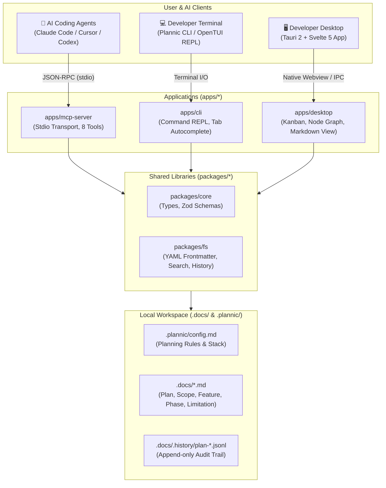

# Plannic

> **Structured Project Planning & Architecture Workbench for Solo Developers & AI Agents**

[](https://bun.sh/)
[](https://tauri.app/)
[](https://svelte.dev/)
[](https://github.com/anomalyco/opentui)
[](https://modelcontextprotocol.io/)
[](LICENSE)

Plannic adalah **local-first planning workbench** yang menggabungkan protokol **Model Context Protocol (MCP)**, aplikasi visual **Desktop (Tauri 2 + Svelte 5)**, dan **Terminal CLI (OpenTUI + SolidJS)** di atas fondasi penyimpanan dokumen Markdown lokal di `.docs/`.

Didesain dengan filosofi **Workshop Tool**: tenang, tanpa bloat, palet warna monochrome ketat (`#0F1117`), border 1px presisi, dan nol ketergantungan cloud.

---

## 🏛️ System Architecture

Plannic mengoperasikan arsitektur multi-tier di mana AI coding agent dan developer manusia berkolaborasi di atas satu sumber kebenaran (*single source of truth*) yang tersimpan dalam format teks biasa di folder `.docs/`:



---

## ✨ Key Capabilities

### 1. 🤖 Dedicated MCP Server (8 Tools)
Menyediakan interface terstruktur untuk AI Agent tanpa perlu mem-parsing teks manual:
- `get_config`: Membaca aturan dan konvensi proyek dari `.plannic/config.md`.
- `init_plan`: Menginisialisasi plan baru dalam mode Quick atau Deep.
- `get_plan`: Mengambil pohon dokumen plan lengkap.
- `update_document`: Memperbarui sub-dokumen markdown dengan kenaikan nomor versi semantik.
- `move_task`: Mengubah status checklist task pada dokumen phase roadmap.
- `list_plans`: Menampilkan daftar semua plan di proyek.
- `search_plans`: Fuzzy search instan pada judul dan isi dokumen.
- `get_history`: Mengambil riwayat audit changelog JSONL.

### 2. 🖥️ Interactive Desktop GUI (Tauri 2 + Svelte 5)
- **Interactive Kanban Board**: Visualisasi task checklist fase implementasi dengan kolom status dinamis (`todo`, `in_progress`, `done`, atau custom column), drag-and-drop interaktif, dan sinkronisasi dua arah dengan AI Agent.
- **Node Graph View (Svelte Flow)**: Visualisasi graf relasi dokumen plan dan dependensi sub-dokumen, lengkap dengan zoom, pan, edge routing, dan Quick Inspector.
- **Document Tree Sidebar**: Navigasi hierarki file plan (`plan`, `scope`, `feature`, `phase`, `limitation`).

### 3. ⌨️ OpenCode-Style Terminal CLI (OpenTUI + SolidJS)
- **Command-Driven REPL**: Aliran feed scrollable di atas dengan input bar interaktif di bawah.
- **Dynamic Tab Autocomplete**: Mendukung auto-completion seperti `cd <folder> [Tab]` untuk melengkapi nama perintah, slug plan proyek (`/open ` + `Tab`), sub-dokumen (`/doc ` + `Tab`), dan status (`/move ` + `Tab`).
- **Zero-Glitch Layout**: Bebas dari masalah absolute overlay terminal; 100% flow layout.
- **Full Clipboard Integration**: Dukungan paste `Ctrl+V` multi-platform dan tombol `Esc` untuk keluar bersih tanpa mengorbankan `Ctrl+C` copy terminal.

### 4. 📋 Document Tree & The 5-Step "Grill Mode"
- **Quick Mode**: 1 file dokumen (`plan-<slug>.md`) untuk tugas terisolasi dan bugfix cepat.
- **Deep Mode**: 5 file dokumen terstruktur (`plan`, `scope`, `feature`, `phase`, `limitation`) untuk arsitektur kompleks.
- **Grill Mode Workflow**: AI Agent mewawancarai developer dengan 3–5 pertanyaan klarifikasi strategis sebelum mulai merancang dokumen plan untuk mencegah *scope creep*.

---

## 📦 Monorepo Structure

```
plannic/
├── packages/
│   ├── core/               # Shared TypeScript interfaces & Zod validation schemas
│   └── fs/                 # Local filesystem engine (.docs/, YAML, history, search, tasks)
├── apps/
│   ├── mcp-server/         # MCP stdio server implementing 8 planning tools
│   ├── desktop/            # Tauri 2 + Svelte 5 visual workbench app
│   └── cli/                # OpenTUI + SolidJS terminal REPL application
├── docs/                   # Developer documentation & technical specs
└── .docs/                  # Runtime planning documents & .history/ JSONL audit trails
```

---

## 🚀 Getting Started

### Prerequisites
- [Bun](https://bun.sh/) >= 1.2 (Package manager & runtime utama)
- [Rust & Cargo](https://rustup.rs/) (Diperlukan jika menjalankan aplikasi Desktop Tauri)

### 1. Install Dependencies
```bash
bun install
```

### 2. Menjalankan Terminal CLI (OpenTUI)
```bash
# Mode REPL Interaktif
bun run plan

# Mode Non-Interaktif
bun run plan list
bun run plan search "kanban"
bun run plan create "Payment Gateway" --mode deep
```

### 3. Menjalankan Desktop GUI
```bash
# Mode Development Desktop (Tauri)
bun run dev:desktop

# Mode Web Browser (Vite dev server)
bun run dev:web
```

### 4. Menjalankan MCP Server
```bash
bun run dev:mcp
```

---

## 🔌 MCP Client Integration

Untuk menghubungkan Plannic dengan AI Coding Agents:

### Claude Code / Claude Desktop (`.mcp.json`)
```json
{
  "mcpServers": {
    "plannic": {
      "command": "bun",
      "args": ["run", "D:/Project/Plannic/apps/mcp-server/src/index.ts"]
    }
  }
}
```

### Binary Precompiled (`plannic-mcp.exe`)
```json
{
  "mcpServers": {
    "plannic": {
      "command": "D:/Project/Plannic/plannic-mcp.exe"
    }
  }
}
```

---

## 📚 Technical Documentation

Untuk spesifikasi teknis mendalam dan logika internal sistem, pelajari dokumen di folder `docs/`:

| Dokumen | Deskripsi |
| :--- | :--- |
| [docs/PRD.md](./docs/PRD.md) | Product Requirements Document & visi dasar Plannic |
| [docs/GUI.md](./docs/GUI.md) | Design tokens, visual hierarchy, dan spesifikasi antarmuka Desktop |
| [docs/ARCHITECTURE.md](./docs/ARCHITECTURE.md) | Topologi sistem, monorepo boundaries, package deep-dive, dan model IPC |
| [docs/LOGIC.md](./docs/LOGIC.md) | Logika bisnis, 5-Step Grill Mode, task state machine, versioning, dan search engine |
| [docs/MCP.md](./docs/MCP.md) | Panduan lengkap 8 tools Model Context Protocol (MCP) & integrasi AI Agent |
| [docs/DESKTOP.md](./docs/DESKTOP.md) | Panduan Desktop Workbench, Interactive Kanban Board, & Node Graph View |
| [docs/CLI.md](./docs/CLI.md) | Panduan lengkap Terminal UI, daftar 11 slash commands, dan Tab autocomplete |

---

## 🛠️ Verification & Quality Assurance

Semua package di dalam monorepo divalidasi dengan typecheck ketat:
```bash
# Typecheck seluruh monorepo
bun run typecheck

# Build binary mandiri CLI
bun run --filter @plannic/cli build
```

---

## 📄 License
MIT © [JustALearner101 / Atar](https://github.com/JustALearner101/Plannic)
