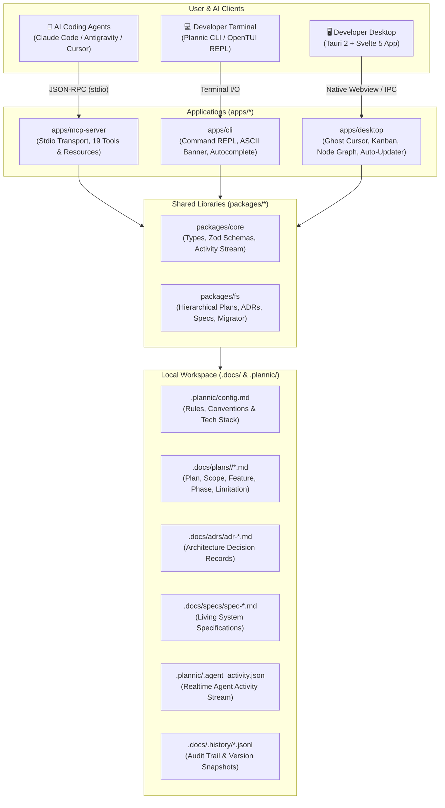
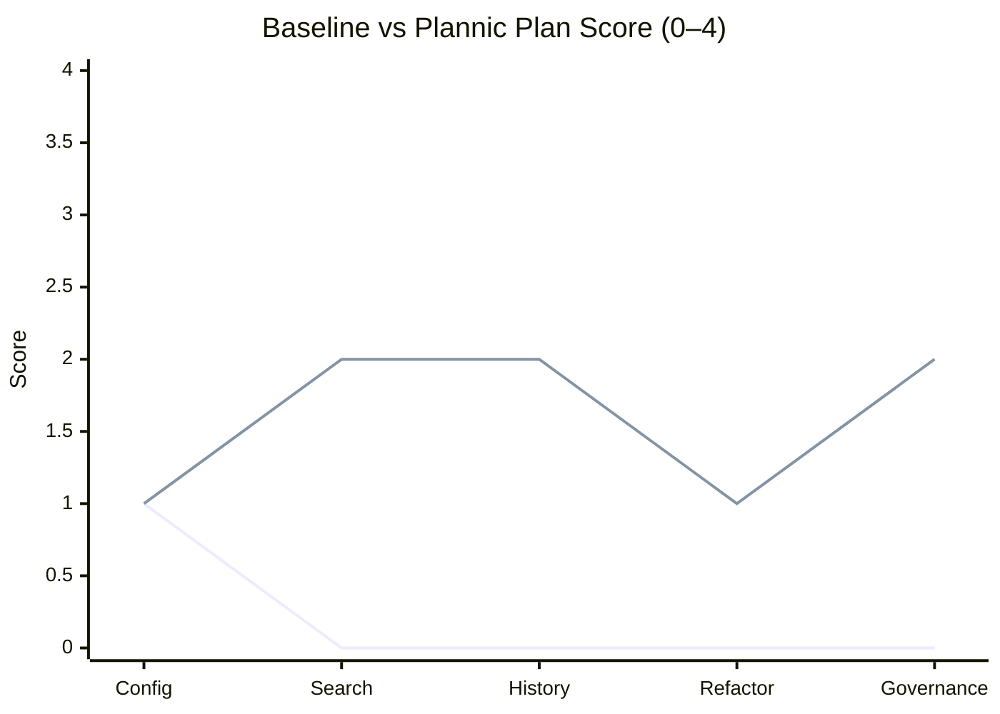

<p align="center">
  <a href="https://github.com/JustALearner101/Plannic">
    
  </a>
</p>

<p align="center">
  <strong>Structured Architecture, Living Specs &amp; Strategic Planning Workbench for Solo Developers &amp; AI Coding Agents</strong>
</p>

<p align="center">
  <strong>English</strong> | <a href="README.id.md">Bahasa Indonesia</a>
</p>

<p align="center">
  <a href="https://github.com/JustALearner101/Plannic/releases"></a>
  <a href="https://bun.sh/"></a>
  <a href="https://tauri.app/"></a>
  <a href="https://svelte.dev/"></a>
  <a href="https://github.com/anomalyco/opentui"></a>
  <a href="https://modelcontextprotocol.io/"></a>
  
  <a href="./LICENSE"></a>
</p>

```text
  ██████╗ ██╗      █████╗ ███╗   ██╗███╗   ██╗██╗ ██████╗
  ██╔══██╗██║     ██╔══██╗████╗  ██║████╗  ██║██║██╔════╝
  ██████╔╝██║     ███████║██╔██╗ ██║██╔██╗ ██║██║██║     
  ██╔═══╝ ██║     ██╔══██║██║╚██╗██║██║╚██╗██║██║██║     
  ██║     ███████╗██║  ██║██║ ╚████║██║ ╚████║██║╚██████╗
  ╚═╝     ╚══════╝╚═╝  ╚═╝╚═╝  ╚═══╝╚═╝  ╚═══╝╚═╝ ╚═════╝
  PLANNIC / Architecture, Living Specs & Planning Workbench v0.3.0
```

---

Plannic is a **local-first engineering workbench** that bridges human software engineers and AI coding agents (*Claude Code, Antigravity, Cursor, Windsurf, Roo Code*) over a universal, file-backed single source of truth in local Markdown under `.docs/`.

Crafted around the **Monochrome Workshop** design philosophy: zero bloat, high performance, strict dark workshop palette (`#0F1117`), razor-sharp 1px borders, and zero cloud or SaaS database dependencies.

> 🤖 **Working with an AI Coding Assistant?** See [AGENT_GUIDE.md](./AGENT_GUIDE.md) for the complete zero-shot onboarding runbook, MCP tool reference, testing guidelines, and auto-updater workflow.

---

## 🚀 Install

### Headless / AI Agent

```bash
curl -fsSL https://raw.githubusercontent.com/JustALearner101/Plannic/main/scripts/install-headless.sh | sh
```

On Windows PowerShell:

```powershell
irm https://raw.githubusercontent.com/JustALearner101/Plannic/main/scripts/install-headless.ps1 | iex
```

### From Source

```bash
git clone https://github.com/JustALearner101/Plannic.git
cd Plannic
bun install
```

See [Quick Start](#-quick-start) for CLI, desktop, and MCP development commands.

---

## 🏛️ System Architecture

Plannic implements a multi-tier local topology where AI agents, the native desktop app, and the terminal CLI collaborate simultaneously over local files:



---

## ✨ Key Capabilities & Highlights

### 1. 👻 Realtime Agent Ghost Cursor & Ambient HUD
- **Ambient Glowing Border**: When an AI agent executes an MCP tool in your terminal or IDE, the desktop window's perimeter glows with an electric cyan border (`#38bdf8`), providing immediate visual confirmation that the agent is actively planning or modifying files.
- **Ghost Cursor**: A semi-transparent AI cursor floats across the Kanban board and documents with an agent badge, visually following what task card or document the AI is manipulating in real time.
- **Top Activity HUD**: Displays a concise, real-time message in the desktop header (*e.g., "Moving task to In Progress..."*).

### 2. 📋 Architecture Decision Records (ADR) Engine
- Formally record critical architectural decisions in `.docs/adrs/`.
- Standardized lifecycle states: `proposed`, `accepted`, `rejected`, `superseded`.
- Full MCP integration (`init_adr`, `get_adr`, `list_adrs`) and Antigravity `/adr` slash command.

### 3. 📐 Living Specifications & System Contracts Engine
- Maintain module contracts, data models, and API specifications in `.docs/specs/`.
- Automatic semantic versioning and append-only audit trail logging.
- Powered by MCP tools (`init_spec`, `get_spec`, `update_spec`, `list_specs`) and the `/spec` slash command.

### 4. 🗂️ Hierarchical Multi-Document Plans
- Complex plans are organized cleanly in dedicated folders under `.docs/plans/<slug>/`:
  - `plan.md`: Executive summary, mode, status, and document index.
  - `scope.md`: Explicit in-scope and out-of-scope boundaries.
  - `feature.md`: Functional feature breakdown and acceptance criteria.
  - `phase-*.md`: Milestone deliverables with interactive markdown task checklists.
  - `limitation.md`: Technical trade-offs, edge cases, and known limitations.
- Built-in migration tool from flat legacy docs (`bun run migrate-docs`).

### 5. ⊞ Interactive Kanban Board & Milestone Graph
- Drag-and-drop task card management across status columns (`todo`, `in_progress`, `done`, or custom columns).
- **Milestone Graph**: Visualizes cross-phase dependencies with animated progress bars.
- Instant, 2-way real-time synchronization between the desktop GUI and AI agent calls to `move_task` or `advance_phase`.

### 6. 🔄 In-App Zero-Touch Auto-Updater
- Powered by `@tauri-apps/plugin-updater` and GitHub Releases.
- Dark floating toast notification with automatic startup version check.
- Shows release notes, real-time download progress bar, and a single-click **"Update & Restart"** action.
- Packages are cryptographically signed using Minisign (`.sig`).

### 7. 🤖 Model Context Protocol (MCP) Server
- Exposes 19 standardized tools & resources for modern LLMs:
  - **Planning**: `init_plan`, `get_plan`, `update_document`, `list_plans`, `search_plans`, `get_history`
  - **Phases & Tasks**: `move_task`, `add_phase`, `advance_phase`, `get_execution_progress`
  - **ADRs**: `init_adr`, `get_adr`, `list_adrs`
  - **Specs**: `init_spec`, `get_spec`, `update_spec`, `list_specs`
  - **Migration & Config**: `get_config`, `migrate_plan`

### 8. ⌨️ OpenTUI Terminal Workbench
- Interactive keyboard-driven TUI with prompt bar, tab autocomplete, and command palette (`Ctrl+K`).
- Modern retro ASCII art banner on startup and help commands.
- Non-interactive direct execution commands (`plan list`, `plan search`, `plan create`).

---

## 📦 Monorepo Structure

```text
Plannic/
├── packages/
│   ├── core/                  # Shared Zod schemas, TypeScript types, paths & activity schemas
│   └── fs/                    # Filesystem engine (Hierarchical docs, ADRs, Specs, Migrator, Tasks)
├── apps/
│   ├── desktop/               # Tauri 2 + Svelte 5 visual workbench (Kanban, Ghost Cursor, Updater)
│   ├── mcp-server/            # stdio MCP server (19 planning, ADR & spec tools)
│   └── cli/                   # OpenTUI-powered interactive terminal interface
├── .docs/                     # Universal Architecture & Planning system of record
│   ├── plans/<slug>/          # Hierarchical multi-document plans
│   ├── adrs/                  # Architecture Decision Records
│   └── specs/                 # Living system specifications & API contracts
├── .plannic/                  # Workspace configuration (.plannic/config.md) & activity stream
├── .github/workflows/         # CI/CD pipelines (e2e.yml, release.yml)
├── e2e/                       # 7-Suite Unified E2E, Playwright & Stability Benchmark Runner
├── scripts/                   # Helper scripts (version bump, migrations)
└── release/                   # Distribution binaries (.exe installer, standalone app & mcp binary)
```

---

## 🚀 Quick Start

### Prerequisites
- [Bun](https://bun.sh/) >= 1.2
- [Rust & Cargo](https://rustup.rs/) (Only needed if compiling the native Tauri desktop app locally)

### 1. Install Dependencies
```bash
bun install
```

### 2. Launch the Terminal CLI
```bash
# Interactive TUI mode:
bun run plan

# Direct non-interactive commands:
bun run plan list
bun run plan search "auth"
bun run plan create "Payment Gateway" --mode deep
```

### 3. Launch the Desktop App
```bash
# Native desktop mode (Tauri 2 hot-reload):
bun run dev:desktop

# Web browser mode (Vite dev server on port 5173):
bun run dev:web
```

### 4. Run the MCP Server
```bash
bun run dev:mcp
```

---

## 🔌 Setup MCP Client (AI Assistant)

Add Plannic to your AI coding assistant configuration (`.mcp.json` in Antigravity, Claude Code, or Cursor):

```json
{
  "mcpServers": {
    "plannic": {
      "command": "bun",
      "args": ["run", "D:/Project/Plannic/apps/mcp-server/src/index.ts"]
    }
  }
}
```

*Or using the standalone precompiled binary (`release/plannic-mcp.exe`):*
```json
{
  "mcpServers": {
    "plannic": {
      "command": "D:/Project/Plannic/release/plannic-mcp.exe"
    }
  }
}
```

---

## 🏷️ Versioning & Automated Releases

Plannic follows strict **Semantic Versioning** (`vMAJOR.MINOR.PATCH`).

### 1. Bumping Version (Single Command)
```bash
# Patch (0.3.0 -> 0.3.1)
bun run bump patch

# Minor (0.3.0 -> 0.4.0)
bun run bump minor

# Specific version
bun run bump 0.3.5
```
*(Automatically synchronizes `tauri.conf.json`, `Cargo.toml`, and all `package.json` manifests).*

### 2. Triggering Automated CI/CD Releases
```bash
git commit -am "chore: release v0.2.1"
git tag v0.2.1
git push origin main --tags
```
The [`.github/workflows/release.yml`](./.github/workflows/release.yml) pipeline automatically verifies the test suite, builds Windows installers (`.exe` NSIS & `.msi`), signs the updater package, and publishes everything to GitHub Releases.

---

## 🧪 Quality Assurance & Testing Suite

The entire Plannic ecosystem is validated by a comprehensive testing pyramid:

```bash
# 1. Monorepo static typecheck (TypeScript & Svelte):
bun run typecheck

# 2. Unit tests (packages/core, packages/fs, apps/mcp-server):
bun run test:all

# 3. 7-Suite Unified E2E & Stability Runner (including Playwright headless browser):
bun run test:e2e
```

## 📊 Planning Benchmark: Better Plans, Less Guesswork

Plannic is designed to solve a specific weakness in default AI-agent planning: plans often sound plausible while missing repository boundaries, dependencies, and architectural decisions.

Our first paired benchmark compares the same five tasks with and without Plannic's structured planning tools:



`Line 1 = baseline plan` · `Line 2 = plan with Plannic`

| Task | Baseline | Plannic |
|---|---:|---:|
| Config validation | 1/4 | 1/4 |
| Cross-module search | 0/4 | 2/4 |
| History API | 0/4 | 2/4 |
| Task parser refactor | 0/4 | 1/4 |
| Plan governance | 0/4 | 2/4 |

| Aggregate | Baseline | Plannic | Change |
|---|---:|---:|---:|
| Mean plan score | 0.2/4 | 1.6/4 | **+1.4** |

**Signal:** Plannic's strongest lift appears on cross-module and architecture-heavy tasks—the exact cases where an agent benefits from explicit context, decisions, and execution boundaries.

The initial signal: Plannic produced stronger plans on 3 of 5 architecture-oriented tasks, while matching or improving the other 2. This is a preliminary harness result—not a claim of implementation uplift yet. The next benchmark stage uses real paired implementation patches to measure test success, scope drift, and correction effort.

Run it locally with `bun run benchmark:planning`. Full notes and raw methodology are in [`benchmarks/planning/VALID-RUN-RESULTS.md`](./benchmarks/planning/VALID-RUN-RESULTS.md).

---

### Install headless mode

For AI agents, CI, and automation without a UI. The installer supports Linux/macOS x64 and ARM64, plus Windows x64. Every artifact is verified with SHA-256.

```sh
curl -fsSL https://raw.githubusercontent.com/JustALearner101/Plannic/main/scripts/install-headless.sh | sh
```

On Windows PowerShell:

```powershell
irm https://raw.githubusercontent.com/JustALearner101/Plannic/main/scripts/install-headless.ps1 | iex
```

Set `PLANNIC_REPO` or `PLANNIC_INSTALL_DIR` to override the defaults.

After installation, open a new terminal and verify it with:

```text
plannic --help
```

`plannic` and `plannic-headless` are both available; on Windows the installer adds the install directory to your User `PATH` automatically.

## 📄 License
MIT © [JustALearner101 / Atar](https://github.com/JustALearner101/Plannic)
