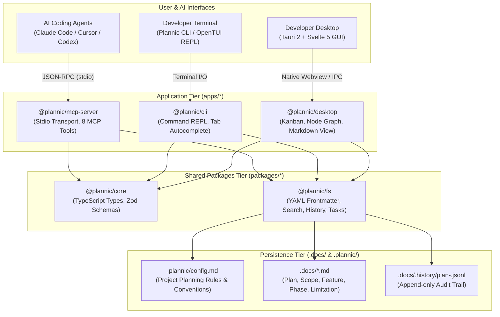

# Plannic System Architecture

**Document Version:** 1.0  
**Status:** Approved  
**Scope:** Monorepo Topology, Packages, Data Flow, and Component Architecture  

---

## 1. High-Level Architecture

Plannic adalah **local-first structured planning workbench** yang menggabungkan tiga antarmuka utama di atas lapisan penyimpanan dokumen markdown lokal:
1. **Model Context Protocol (MCP) Server**: Antarmuka berbasis standar JSON-RPC stdio untuk AI coding agents (Claude Code, Cursor, Antigravity, dsb.).
2. **Desktop Application**: Antarmuka GUI berbasis Tauri 2 + Svelte 5 dengan Interactive Kanban Board dan Svelte Flow Node Graph View.
3. **Terminal CLI (TUI)**: Antarmuka command-driven REPL berbasis OpenTUI + SolidJS dengan popover autocomplete dan navigasi keyboard cepat.



---

## 2. Monorepo Organization & Boundaries

Plannic dikelola dalam monorepo Bun dengan arsitektur berorientasi modul yang ketat:

```
plannic/
├── packages/
│   ├── core/               # Shared type definitions and Zod validation schemas
│   └── fs/                 # Local filesystem engine (.docs/, YAML, history, search)
├── apps/
│   ├── mcp-server/         # MCP stdio server implementing 8 planning tools
│   ├── desktop/            # Tauri 2 + Svelte 5 desktop workbench app
│   └── cli/                # OpenTUI + SolidJS command REPL terminal app
├── docs/                   # Developer documentation (PRD, GUI, ARCHITECTURE, LOGIC, CLI)
└── .docs/                  # Runtime planning documents generated by Plannic
```

### Dependency Hierarchy & Boundary Rules:
- **`packages/core`** berada di level terbawah. Tidak boleh memiliki dependensi ke package internal lain, dan minim dependensi eksternal (hanya `zod`).
- **`packages/fs`** bergantung pada `packages/core`. Mengelola operasi disk, parsing markdown/YAML, manipulasi string, dan audit trail. Tidak boleh bergantung pada aplikasi di `apps/*`.
- **`apps/mcp-server`**, **`apps/desktop`**, dan **`apps/cli`** adalah konsumen akhir dari `packages/core` dan `packages/fs`.

---

## 3. Package & Component Deep-Dive

### 3.1 `packages/core` (Domain Contracts & Schemas)
Menyediakan kontrak tipe data tunggal untuk seluruh monorepo guna menjamin type safety di backend, frontend desktop, terminal, dan MCP server.

- **Types (`src/types.ts`)**:
  - `Plan`: Representasi struktur dokumen plan lengkap (`slug`, `mode`, `root`, `documents`).
  - `PlanDocument`: File dokumen individual (`slug`, `type`, `path`, `frontmatter`, `body`, `rawContent`).
  - `DocFrontmatter`: Metadata YAML di setiap file markdown (`id`, `plan`, `type`, `name`, `slug`, `version`, `status`, `created`, `lastUpdated`, `tags`, `description`, `mode`).
  - `PlanSummary`: Metadata ringkas untuk tabel daftar plan.
  - `HistoryEntry`: Entri audit trail revisi dokumen.
  - `MoveTaskOutput`, `SearchResult`, `ProjectConfig`.
- **Schemas (`src/schemas.ts`)**:
  - Validasi runtime Zod untuk input dan output semua tool MCP (misal `InitPlanInputSchema`, `UpdateDocumentInputSchema`, `MoveTaskInputSchema`).

### 3.2 `packages/fs` (Persistence & File Operations Engine)
Mengabstraksi seluruh interaksi I/O disk ke direktori `.docs/` dan `.plannic/`:

- **Reader (`src/reader.ts`)**:
  - `listPlans(cwd)`: Membaca seluruh file `plan-*.md` di `.docs/`, mem-parse frontmatter YAML, dan mengembalikan array `PlanSummary[]`.
  - `readPlan(cwd, slug)`: Membaca dokumen root dan semua sub-dokumen terkait (`scope`, `feature`, `phase`, `limitation`), menyusunnya menjadi tree struktur `Plan`.
- **Writer (`src/writer.ts`)**:
  - `initPlan(cwd, name, mode, description)`: Menginisialisasi plan baru dalam mode `quick` (1 file) atau `deep` (5 sub-dokumen), menulis frontmatter YAML via `gray-matter`, dan mencatat entry pertama di `.history/`.
  - `updateDocument(cwd, slug, docType, body, summary, changedBy)`: Memperbarui body dokumen markdown, menaikkan nomor versi semantik (misal `1.0` ➔ `1.1`), memperbarui timestamp `lastUpdated`, dan merekam entri changelog ke `.history/`.
- **History (`src/history.ts`)**:
  - `appendHistory(cwd, slug, entry)`: Menulis entri JSONL ke `.docs/.history/plan-<slug>.jsonl`.
  - `readHistory(cwd, slug)`: Membaca dan mem-parse seluruh entri changelog historis sebuah plan.
- **Tasks (`src/tasks.ts`)**:
  - `moveTask(cwd, slug, taskIdentifier, newStatus)`: Mem-parse checklist task markdown di file dokumen phase, mencocokkan baris target berdasarkan taskId atau judul teks, memperbarui status (`[ ]` ➔ `[x]` / `[/]` / `[custom]`), dan menyimpan kembali dokumen dengan revisi baru.
- **Search (`src/search.ts`)**:
  - `searchPlans(cwd, query, limit)`: Melakukan in-memory fuzzy search pada judul, frontmatter tags, dan konten teks di seluruh file `.docs/` dengan menyajikan cuplikan excerpt kecocokan teks.
- **Config (`src/config.ts`)**:
  - Membaca `.plannic/config.md` untuk memuat aturan planning proyek (`project`, `stack`, `default_mode`, `lang`).

### 3.3 `apps/mcp-server` (Model Context Protocol Gateway)
Server MCP berbasis TypeScript yang dijalankan via `bun run dev:mcp` menggunakan SDK resmi `@modelcontextprotocol/sdk`:

- **Transport**: Stdio transport (`StdioServerTransport`), berkomunikasi via standar input/output JSON-RPC.
- **8 MCP Dedicated Tools**:
  1. `get_config`: Membaca aturan dan konvensi dari `.plannic/config.md`.
  2. `init_plan`: Menginisialisasi plan baru dalam mode quick atau deep.
  3. `get_plan`: Mengambil pohon dokumen lengkap sebuah plan.
  4. `update_document`: Memperbarui isi markdown sub-dokumen tertentu.
  5. `move_task`: Mengubah status checklist task pada roadmap phase.
  6. `list_plans`: Menampilkan ringkasan semua plan di repositori.
  7. `search_plans`: Melakukan pencarian teks di seluruh dokumen.
  8. `get_history`: Mengambil riwayat revisi changelog JSONL.

### 3.4 `apps/desktop` (Tauri 2 + Svelte 5 GUI Workbench)
Aplikasi desktop lokal untuk visualisasi dan manajemen plan dengan estetika monochrome workshop:

- **Backend (Rust / Tauri 2)**:
  - Menyediakan runtime native windowing, file system IPC bridge, dan fast startup.
- **Frontend (Svelte 5 Runes + Vite + TailwindCSS)**:
  - **Document Tree Sidebar**: Navigasi hierarki plan dan sub-dokumen (`plan`, `scope`, `feature`, `phase`, `limitation`).
  - **Interactive Kanban Board**: Visualisasi task checklist fase implementasi dengan kolom status dinamis (`todo`, `in_progress`, `done`, atau custom column), drag-and-drop interaktif, dan sinkronisasi dua arah dengan AI agent.
  - **Node Graph View (Svelte Flow)**: Visualisasi graf relasi dokumen plan dan dependensi sub-dokumen, lengkap dengan zoom, pan, edge routing, dan Quick Inspector.
  - **Quick Search Modal (⌘K)**: Dialog pencarian instan antar dokumen plan.

### 3.5 `apps/cli` (OpenTUI + SolidJS Terminal Edition)
Aplikasi antarmuka terminal interaktif yang mengadopsi model **Command-Driven REPL** ala OpenCode:

- **Runtime**: OpenTUI (`@opentui/core`, `@opentui/solid`) dengan rendering ANSI terminal berperforma tinggi.
- **Command REPL Loop**:
  - `Header`: Menampilkan branding monochrome, active workspace path, dan indikator plan aktif.
  - `Feed`: Viewport kronologis scrollable yang merender hasil eksekusi perintah (tabel plan, markdown viewer, kartu hasil pencarian, cheatsheet).
  - `PromptBar`: Input 1-baris dengan cursor visual, history navigasi `Panah Atas / Bawah`, dan integrasi clipboard sistem (`Ctrl+V` paste, `Esc` quit).
  - `AutocompletePopover`: Dropdown mengambang di atas prompt bar dengan dukungan **Tab Autocomplete** untuk nama perintah, slug plan proyek, jenis sub-dokumen, dan status task.

---

## 4. Data Flow & Communication Models

### 4.1 AI Agent ⟷ Local Disk (via MCP)
1. AI Agent mengirim request JSON-RPC melalui stdio ke `apps/mcp-server` (misal tool call `move_task`).
2. Server MCP memvalidasi parameter menggunakan skema Zod dari `packages/core`.
3. Server memanggil fungsi `moveTask()` di `packages/fs`.
4. `packages/fs` membaca file markdown terkait di `.docs/`, memodifikasi baris checklist, menaikkan nomor versi frontmatter, merekam entri ke `.docs/.history/plan-<slug>.jsonl`, dan menuliskan file kembali ke disk secara atomik.
5. Hasil kembalian dikirim kembali ke AI Agent sebagai respon tool MCP.

### 4.2 Desktop GUI & Terminal CLI ⟷ Local Disk
- Baik `apps/desktop` maupun `apps/cli` membaca dan memodifikasi file dokumen markdown yang sama di folder `.docs/`.
- Perubahan yang dilakukan oleh AI Agent (melalui MCP) langsung terlihat oleh developer di Desktop GUI atau CLI, dan sebaliknya, perubahan status task via drag-and-drop di Desktop GUI langsung tersimpan ke file markdown sehingga dapat dibaca oleh AI Agent.

---

## 5. Security, Concurrency & Offline Guarantee

1. **Local-First & Zero Telemetry**:
   - Seluruh data plan disimpan secara lokal di repositori proyek dalam format teks biasa (Markdown + JSONL).
   - Tidak ada panggilan API eksternal atau server cloud pihak ketiga.
2. **Directory Confinement**:
   - Seluruh operasi I/O dibatasi di dalam path proyek (`cwd`) yang diberikan, mencegah pembacaan atau penulisan di luar lingkup repositori.
3. **Auditability**:
   - Setiap mutasi dokumen dicatat dengan atribut `changedBy` ('ai-agent' | 'desktop' | 'cli' | 'manual'), stempel waktu ISO 8601, ringkasan perubahan, dan nomor versi semantik di file `.docs/.history/plan-<slug>.jsonl`.
