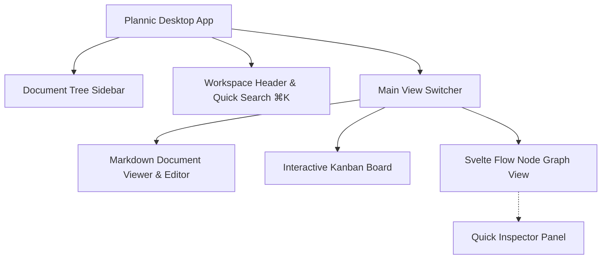

# Plannic Desktop GUI Workbench Specification

**Document Version:** 1.0  
**Status:** Approved  
**Scope:** Tauri 2, Svelte 5, Kanban Board, Svelte Flow Node Graph, and UI Interactions  

---

## 1. Overview & Philosophy

Plannic Desktop (`apps/desktop`) adalah visual workbench lokal yang dibangun dengan **Tauri 2**, **Svelte 5 (Runes)**, dan **Vite**. 

Aplikasi ini mengusung estetika **Workshop Tool**: antarmuka bernuansa gelap monochrome (`#0E0F14` void, `#13141A` surface, `#1E2030` border), tipografi presisi (`Geist` & `Geist Mono`), border 1px tipis, dan minim gangguan visual. Aplikasi ini dirancang agar developer dapat meninjau, menginspeksi, dan memanipulasi rencana arsitektur secara visual dengan cepat setelah dirancang bersama AI Agent.

---

## 2. Core Visual Views & Panels



---

## 3. Detailed Features

### 3.1 Document Tree Sidebar
- **Hierarchical Navigation**: Menampilkan seluruh file `.docs/` dalam struktur pohon intuitif. Setiap plan mengelompokkan sub-dokumennya (`plan`, `scope`, `feature`, `phase`, `limitation`).
- **Metadata Badges**: Menampilkan status plan (`draft` amber, `review` purple, `final` hijau) dan mode plan (`quick` vs `deep`).
- **Quick Switch**: Klik satu kali untuk langsung memuat dokumen ke area kerja utama.

### 3.2 Interactive Kanban Board
Visualisasi tugas checklist fase roadmap (`phase-*.md`) dalam format kartu kanban drag-and-drop:

- **Kolom Bawaan**:
  - **`Todo`**: Menampung task bertanda `- [ ]`.
  - **`In Progress`**: Menampung task bertanda `- [/]`.
  - **`Done`**: Menampung task bertanda `- [x]`.
- **Dukungan Custom Columns**: Pengguna dapat menambahkan kolom status kustom (misal `review`, `blocked`, `testing`).
- **Drag-and-Drop Interaktif**:
  - Memindahkan kartu antar kolom secara visual langsung memicu pembaruan baris markdown di file disk secara atomik.
  - Nomor versi dokumen dinaikkan dan entri riwayat dicatat di `.history/`.
- **Sinkronisasi Dua Arah (Bi-directional Sync)**:
  - Jika AI Coding Agent memindahkan task melalui MCP tool `move_task`, kartu di papan Kanban akan langsung ter-update.
  - Sebaliknya, pemindahan kartu di Kanban dapat dibaca secara instan oleh AI Agent.

### 3.3 Svelte Flow Node Graph View
Visualisasi topologi dokumen plan berbasis graf interaktif menggunakan **Svelte Flow**:

- **Node Graph Topology**:
  - Node Root: Representasi dokumen utama plan (`plan-<slug>.md`).
  - Child Nodes: Node sub-dokumen (`scope`, `feature`, `phase`, `limitation`).
  - Edges: Garis koneksi terarah yang menggambarkan hierarki dan dependensi dokumen.
- **Canvas Controls**:
  - Pan & Zoom halus dengan trackpad atau mouse wheel.
  - *Fit View* tombol untuk memposisikan seluruh graf ke tengah layar.
  - Minimap di sudut kanan bawah untuk navigasi graf berskala besar.
- **Quick Inspector Panel**:
  - Mengklik sebuah node akan membuka panel geser (*slide-over inspector*) di sebelah kanan.
  - Menampilkan metadata YAML frontmatter, deskripsi tujuan, serta ringkasan kutipan dokumen tanpa perlu berpindah halaman.

### 3.4 Markdown Document Viewer & Editor
- Menampilkan dokumen markdown dengan formatting bersih, tabel rapi, dan blok kode dengan syntax styling.
- Mendukung interaksi checklist langsung: mengklik checkbox `- [ ]` di viewer langsung mengubah status task.

### 3.5 Quick Search Modal (⌘K / Ctrl+K)
- Modal pencarian instan global untuk mencari plan atau kata kunci dokumen di seluruh workspace secara fuzzy.
- Navigasi keyboard penuh (`Panah Atas / Bawah` untuk memilih, `Enter` untuk membuka, `Esc` untuk menutup).

---

## 4. Cara Menjalankan & Membangun Desktop

### Mode Development (Tauri Native Window)
```bash
bun run dev:desktop
```
Perintah ini akan menjalankan Vite dev server dan meluncurkan binary native Tauri 2 dengan hot-reload aktif.

### Mode Web Browser (Preview Cepat)
```bash
bun run dev:web
```
Membuka antarmuka Svelte 5 langsung di browser (default: `http://localhost:5173`).

### Production Build
```bash
bun run --filter @plannic/desktop build
```
Menghasilkan bundle web teroptimasi dan binary installer desktop mandiri (melalui `tauri build`).

---

## 5. Design Tokens & Typography

Mengacu pada spesifikasi di [docs/GUI.md](./GUI.md):
- **Void Background**: `#0E0F14`
- **Surface Background**: `#13141A`
- **Subtle Border**: `#1E2030`
- **Active Accent**: `#5B6BF8` (Indigo)
- **Primary Text**: `#E2E4EE`
- **Muted Text**: `#5C5F78`
- **Typography**: `Geist` (UI Text) & `Geist Mono` (Code, Slug, Version)
