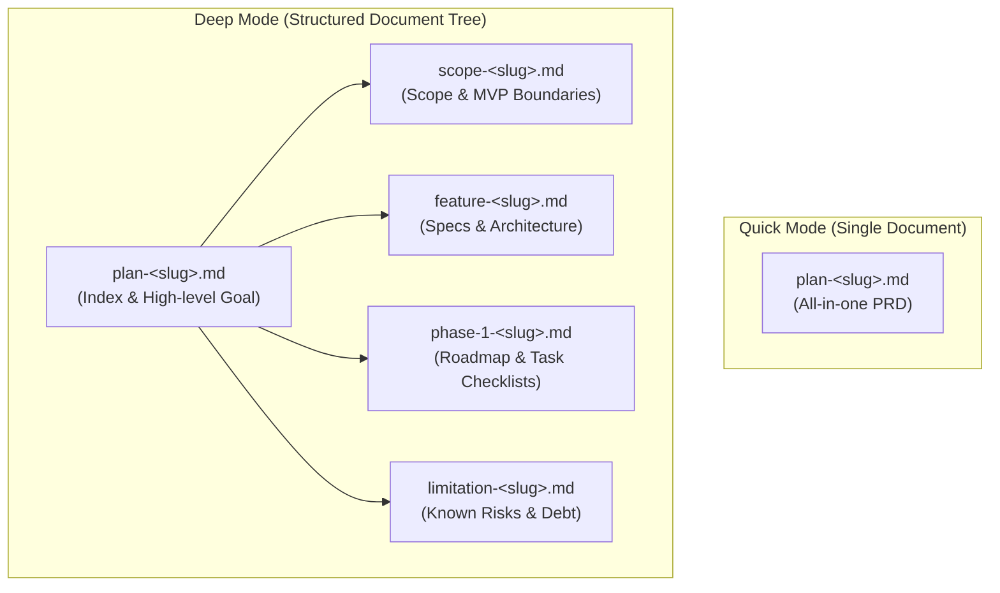
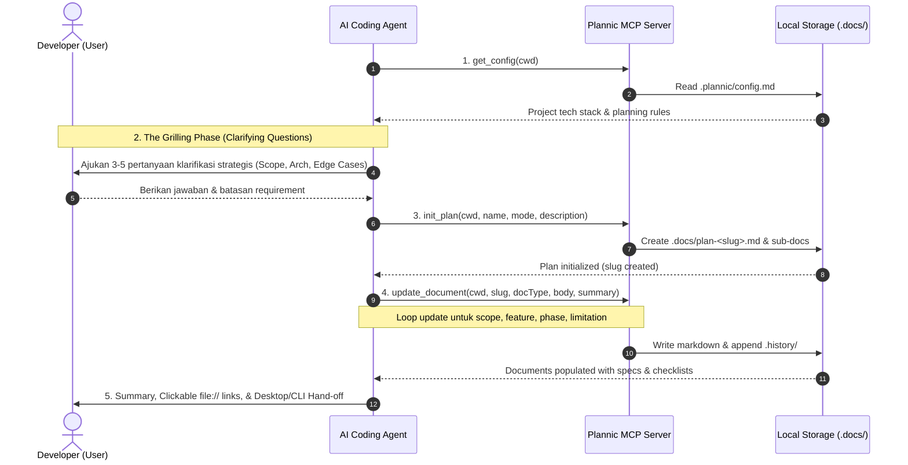

# Plannic Business Logic & Workflows

**Document Version:** 1.0  
**Status:** Approved  
**Scope:** Document Tree Models, Grill Mode Planning Workflow, Task State Machine, Versioning, and Search Engine  

---

## 1. Document Tree Paradigm

Plannic mengorganisasikan dokumen perencanaan ke dalam struktur **Document Tree** berbasis Markdown dan YAML frontmatter di folder `.docs/`. Format ini dipilih agar dokumen dapat dibaca oleh manusia (*human-readable*), dapat dikelola di bawah Git (*version-controlled*), dan ramah context-window AI (*token-efficient*).

Plannic mendukung dua mode dokumen:



### 1.1 Quick Mode (1 File)
- **File**: `.docs/plan-<slug>.md`
- **Tujuan**: Untuk inisiatif terisolasi, bugfix, atau fitur berlingkup tunggal (1-2 hari kerja).
- **Isi**: Menggabungkan Goal, Scope, Deliverables, dan Verification dalam satu file dokumen terpadu.

### 1.2 Deep Mode (5 Files Tree)
- **Tujuan**: Untuk fitur kompleks, inisiatif arsitektur, atau sistem multi-fase.
- **Daftar Sub-Dokumen**:
  1. **`plan-<slug>.md` (Root Document)**: Indeks dokumen, visi, tujuan strategis, dan daftar sub-dokumen.
  2. **`scope-<slug>.md` (Scope & Boundaries)**: Latar belakang masalah, deliverable *In Scope*, item eksplisit *Out of Scope*, dan kriteria sukses (Definition of Done).
  3. **`feature-<slug>.md` (Technical & Functional Specs)**: Diagram arsitektur (Mermaid), kontrak API/data, state machine, dan interaksi modul.
  4. **`phase-<N>-<slug>.md` (Implementation Roadmap)**: Rencana bertahap per fase dengan checklist tugas terperinci (`- [ ] Task ...`) dan kriteria verifikasi.
  5. **`limitation-<slug>.md` (Limitations & Trade-offs)**: Batasan teknis, trade-off arsitektur, risiko sistem, dan utang teknis yang disengaja.

---

## 2. The 5-Step "Grill Mode" Workflow

Setiap kali pengguna atau AI agent menginisialisasi perencanaan fitur (melalui slash command `/plannic` atau instruksi bahasa alami), Plannic menegakkan alur kerja **5-Step Grill Mode**:



### Langkah 1: Read Project Context
AI Agent memanggil `get_config(cwd)` untuk membaca aturan proyek dari `.plannic/config.md` (tech stack, konvensi penamaan, aturan monorepo).

### Langkah 2: The Grilling Phase (Pertanyaan Klarifikasi)
**Aturan Utama:** AI Agent dilarang langsung membuat dokumen tanpa memvalidasi requirement. Agent harus mengajukan 3–5 pertanyaan berdaya ungkit tinggi kepada developer:
1. *Batas Scope & MVP*: Apa yang wajib ada di Fase 1 dan apa yang ditunda ke Fase 2?
2. *Arsitektur & Integrasi*: Bagaimana fitur ini terhubung dengan sistem yang ada (database, state, API)?
3. *Edge Cases & Failure Modes*: Penanganan kegagalan jaringan, offline, timeout, atau validasi?
4. *Persyaratan Non-Fungsional*: Batasan latency, keamanan, ukuran bundle, atau aksesibilitas?

### Langkah 3: Initialize the Plan
Setelah user memberikan konfirmasi, Agent memanggil `init_plan()` untuk mengenerate slug unik dan kerangka file dokumen di `.docs/`.

### Langkah 4: Populate Document Sections
Agent memanggil `update_document()` untuk setiap jenis dokumen (`scope`, `feature`, `phase`, `limitation`) dengan konten teknis, diagram Mermaid, dan checklist task yang actionable.

### Langkah 5: Summary & Hand-off
Agent menyajikan ringkasan dokumen, tautan file lokal yang dapat diklik (`file://`), dan ajakan membuka plan di **Plannic Desktop** atau **Plannic CLI**.

---

## 3. Task Management & Movement Engine

Plannic mengintegrasikan sistem pelacakan tugas berbasis teks yang disinkronkan secara dua arah antara file markdown dan antarmuka interaktif (Desktop Kanban Board & CLI `/move`).

### 3.1 Task Line Parsing Regex
Checklist task di dokumen `phase-*.md` di-parse menggunakan regular expression:

```typescript
const CHECKLIST_REGEX = /^(\s*-\s*\[)([a-zA-Z0-9_\-\/ ]*)(\]\s*)(.+)$/;
```

Pola ini menangkap:
- Group 1: Indentasi dan prefix pembuka (`- [`)
- Group 2: Status marker di dalam tanda kurung siku (misal spasi ` `, `x`, `/`, atau custom status seperti `blocked`, `review`)
- Group 3: Prefix penutup (`] `)
- Group 4: Judul dan deskripsi task (misal `Task 1.1: Buat modul auth`)

### 3.2 Status Marker Mapping
| Simbol Marker | Nama Kolom Status | Arti / Lifecycle State |
| :--- | :--- | :--- |
| `- [ ]` | `todo` | Belum dimulai / pending |
| `- [/]` | `in_progress` | Sedang dikerjakan |
| `- [x]` / `- [X]` | `done` | Selesai dan terverifikasi |
| `- [review]` | `review` (custom) | Sedang ditinjau / QA |
| `- [blocked]` | `blocked` (custom) | Terkendala dependensi lain |

### 3.3 Logika Pemindahan Task (`moveTask`)
Ketika task dipindahkan (oleh AI Agent via MCP `move_task`, oleh user via CLI `/move`, atau via Drag-and-Drop di Desktop Kanban Board):
1. **Pencarian Dokumen**: Mencari dokumen `phase` dalam plan target.
2. **Identifikasi Task**:
   - Jika `taskIdentifier` berupa angka (misal `"1.1"` atau `"2"`), engine mencari task dengan nomor indeks atau string `"1.1"` pada baris markdown.
   - Jika berupa teks, engine melakukan pencocokan parsial case-insensitive pada judul task.
3. **Mutasi Baris**: Karakter di dalam `[ ]` diganti dengan marker status baru (misal ` ` ➔ `/` untuk `in_progress`).
4. **Version Bump & Audit Log**:
   - Nomor versi dokumen dinaikkan secara semantik.
   - Entri baru dicatat ke file riwayat `.history/`.
   - File markdown ditulis ulang secara atomik.

---

## 4. Versioning & Audit Trail Engine

Setiap dokumen di Plannic memiliki nomor versi semantik di dalam frontmatter YAML (`version: "1.0"`).

### 4.1 Logika Kenaikan Versi (*Version Bump*)
```typescript
function bumpVersion(currentVersion: string): string {
  const parts = currentVersion.split(".");
  const major = parseInt(parts[0], 10) || 1;
  const minor = parseInt(parts[1], 10) || 0;
  return `${major}.${minor + 1}`;
}
```
Setiap kali `updateDocument()` atau `moveTask()` dipanggil, versi dinaikkan dari `1.0` ➔ `1.1` ➔ `1.2`. Jika terjadi revisi arsitektur besar, versi dapat dinaikkan ke `2.0`.

### 4.2 Append-Only History Log (`.jsonl`)
Riwayat audit disimpan di `.docs/.history/plan-<slug>.jsonl`. Setiap baris adalah JSON independen berformat `HistoryEntry`:

```json
{
  "timestamp": "2026-09-14T08:37:42.322Z",
  "type": "updated",
  "version": "1.1",
  "summary": "Add technical specification, component tree, and data structures",
  "changedBy": "claude-code",
  "document": "feature-plannic-cli-tui-revamp-opencode-style.md",
  "docType": "feature"
}
```

Format JSONL menjamin kecepatan penulisan (*append-only* tanpa perlu mem-parse ulang seluruh file riwayat) dan anti-konflik saat di-*merge* di Git.

---

## 5. In-Memory Fuzzy Search Engine

Fungsi `searchPlans(cwd, query, limit)` di `packages/fs` melakukan pencarian teks berkecepatan tinggi tanpa memerlukan database eksternal:

### 5.1 Tahapan Pencarian:
1. **Scanning**: Membaca seluruh file `.md` yang ada di `.docs/`.
2. **Field Evaluation**:
   - Pencocokan pada **Slug & Title** (Bobot tertinggi: score +100).
   - Pencocokan pada **Tags** (Bobot menengah: score +50).
   - Pencocokan pada **Body Markdown** (Bobot konten: score +10 per kemunculan).
3. **Excerpt Generation**:
   - Jika query ditemukan di dalam body dokumen, engine mengekstrak jendela teks 80 karakter sebelum dan sesudah kata kunci yang cocok, menambahkan tanda elipsis `...`, dan menampilkannya sebagai `excerpt` untuk memudahkan preview konteks.
4. **Ranking & Limiting**: Hasil diurutkan berdasarkan skor tertinggi dan dipotong sesuai batas `limit` (default: 10 atau 20).

---

## 6. Slugging & File Naming Conventions

Untuk menjamin kompatibilitas lintas sistem operasi (Linux, macOS, Windows) dan URL-safe routing:

### 6.1 Algoritma Pembentukan Slug:
```typescript
export function generateSlug(input: string): string {
  return input
    .toLowerCase()
    .trim()
    .replace(/[^\w\s-]/g, "")    // Hapus karakter khusus non-alphanumeric
    .replace(/[\s_-]+/g, "-")    // Ganti spasi dan underscore dengan tanda minus
    .replace(/^-+|-+$/g, "");    // Hapus minus di awal dan akhir string
}
```

### 6.2 Aturan Nama File Dokumen:
- Root Plan: `plan-<slug>.md`
- Scope: `scope-<slug>.md`
- Feature: `feature-<slug>.md`
- Phase N: `phase-<N>-<slug>.md`
- Limitation: `limitation-<slug>.md`
- History Log: `.history/plan-<slug>.jsonl`
