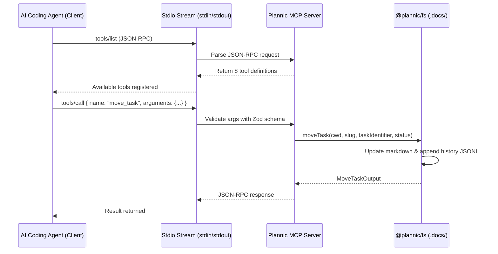

# Plannic MCP Server Specification & Integration Guide

**Document Version:** 1.0  
**Status:** Approved  
**Scope:** Model Context Protocol (MCP) Tools, JSON-RPC Stdio Transport, Client Setup, and Schemas  

---

## 1. Overview

Plannic MCP Server (`apps/mcp-server`) mengimplementasikan spesifikasi resmi **Model Context Protocol (MCP)** melalui transportasi `stdio`. Server ini bertindak sebagai jembatan komunikasi standar antara AI coding agent (seperti Claude Code, Cursor, Codex, Antigravity) dan penyimpanan dokumen lokal Plannic di `.docs/`.

Dengan MCP, AI agent dapat membaca, membuat, memodifikasi dokumen arsitektur, dan memindahkan task checklist secara terstruktur menggunakan tool calls berkontrak ketat, tanpa perlu memanipulasi file teks mentah secara manual.

---

## 2. Server Architecture & Transport



- **Runtime**: Bun / Node.js
- **Protocol**: JSON-RPC 2.0 via standard input/output (`stdio`)
- **Validation**: Runtime parameter validation menggunakan **Zod** (`packages/core/src/schemas.ts`)
- **Error Handling**: Standardized MCP error codes (`-32602` for invalid arguments, `-32603` for internal errors)

---

## 3. The 8 MCP Dedicated Tools

### 3.1 `get_config`
Membaca konfigurasi dan aturan perencanaan proyek dari file `.plannic/config.md`.

- **Input Parameters**:
  - `cwd` (string, required): Path absolut ke folder root proyek.
- **Output**:
  - Markdown content dan metadata proyek (`project`, `stack`, `default_mode`, `lang`).
- **Contoh Payload**:
  ```json
  {
    "name": "get_config",
    "arguments": {
      "cwd": "D:/Project/Plannic"
    }
  }
  ```

---

### 3.2 `init_plan`
Menginisialisasi plan baru di folder `.docs/` dalam mode `quick` (1 file) atau `deep` (5 file dokumen terstruktur).

- **Input Parameters**:
  - `cwd` (string, required): Path absolut ke folder root proyek.
  - `name` (string, required): Nama deskriptif plan (misal `"Payment Gateway Integration"`).
  - `mode` (string, optional, enum: `["quick", "deep"]`, default: `"deep"`).
  - `description` (string, optional): Ringkasan singkat tujuan plan.
- **Output**:
  - `status`: `"ok"`
  - `slug`: Slug kebab-case yang digenerate (misal `"payment-gateway-integration"`).
  - `filesCreated`: Array nama file yang dibuat di `.docs/`.
- **Contoh Payload**:
  ```json
  {
    "name": "init_plan",
    "arguments": {
      "cwd": "D:/Project/Plannic",
      "name": "Stripe Payment Gateway",
      "mode": "deep",
      "description": "Integrasi gateway pembayaran Stripe untuk langganan premium"
    }
  }
  ```

---

### 3.3 `get_plan`
Mengambil hierarki pohon dokumen lengkap dari sebuah plan yang sudah ada.

- **Input Parameters**:
  - `cwd` (string, required): Path absolut ke folder root proyek.
  - `slug` (string, required): Slug plan yang ingin diambil.
- **Output**:
  - Konten teks lengkap dari dokumen root dan seluruh sub-dokumen (`scope`, `feature`, `phase`, `limitation`).
- **Contoh Payload**:
  ```json
  {
    "name": "get_plan",
    "arguments": {
      "cwd": "D:/Project/Plannic",
      "slug": "stripe-payment-gateway"
    }
  }
  ```

---

### 3.4 `update_document`
Memperbarui isi markdown dari sub-dokumen tertentu dalam sebuah plan.

- **Input Parameters**:
  - `cwd` (string, required): Path absolut ke folder root proyek.
  - `slug` (string, required): Slug plan target.
  - `docType` (string, required, enum: `["plan", "scope", "feature", "phase", "limitation"]`).
  - `body` (string, required): Isi teks markdown baru untuk dokumen tersebut.
  - `changeSummary` (string, optional): Ringkasan perubahan untuk audit trail.
  - `changedBy` (string, optional, default: `"claude-code"`): Aktor pengubah.
- **Output**:
  - `success`: `true`
  - `version`: Nomor versi baru yang sudah dinaikkan (misal `"1.1"`).
  - `path`: Path absolut file di disk.
- **Contoh Payload**:
  ```json
  {
    "name": "update_document",
    "arguments": {
      "cwd": "D:/Project/Plannic",
      "slug": "stripe-payment-gateway",
      "docType": "scope",
      "body": "# Scope & Boundaries\n\n## In Scope\n- Webhook processing...",
      "changeSummary": "Menambahkan spesifikasi penanganan webhook Stripe"
    }
  }
  ```

---

### 3.5 `move_task`
Mengubah status task checklist pada dokumen fase roadmap (`phase-*.md`). Terhubung langsung secara dua arah dengan Interactive Kanban Board Desktop.

- **Input Parameters**:
  - `cwd` (string, required): Path absolut ke folder root proyek.
  - `slug` (string, required): Slug plan target.
  - `taskIdentifier` (string, required): Nomor indeks task (misal `"1.1"` atau `"2"`) atau substring judul task.
  - `newStatus` (string, required): Status baru (`"todo"`, `"in_progress"`, `"done"`, atau custom status).
  - `phaseSlug` (string, optional): Slug dokumen phase spesifik jika terdapat multi-phase.
  - `comment` (string, optional): Catatan revisi.
- **Output**:
  - `success`: `true`
  - `taskTitle`: Judul lengkap task yang cocok.
  - `previousStatus`: Status lama sebelum dipindahkan.
  - `newStatus`: Status baru setelah dipindahkan.
  - `documentFile`: Nama file dokumen phase yang diperbarui.
  - `version`: Versi dokumen baru.
- **Contoh Payload**:
  ```json
  {
    "name": "move_task",
    "arguments": {
      "cwd": "D:/Project/Plannic",
      "slug": "stripe-payment-gateway",
      "taskIdentifier": "1.1",
      "newStatus": "done"
    }
  }
  ```

---

### 3.6 `list_plans`
Menampilkan ringkasan seluruh plan yang ada di folder `.docs/`.

- **Input Parameters**:
  - `cwd` (string, required): Path absolut ke folder root proyek.
- **Output**:
  - Array objek `PlanSummary` (slug, name, mode, status, version, lastUpdated, documentCount).
- **Contoh Payload**:
  ```json
  {
    "name": "list_plans",
    "arguments": {
      "cwd": "D:/Project/Plannic"
    }
  }
  ```

---

### 3.7 `search_plans`
Melakukan in-memory fuzzy search pada judul, tag, dan isi body seluruh dokumen di repositori.

- **Input Parameters**:
  - `cwd` (string, required): Path absolut ke folder root proyek.
  - `query` (string, required): Kata kunci pencarian.
  - `limit` (number, optional, default: 10): Jumlah hasil maksimal.
- **Output**:
  - Array objek `SearchResult` dengan skor relevansi dan cuplikan teks konteks (*match excerpt*).
- **Contoh Payload**:
  ```json
  {
    "name": "search_plans",
    "arguments": {
      "cwd": "D:/Project/Plannic",
      "query": "webhook",
      "limit": 5
    }
  }
  ```

---

### 3.8 `get_history`
Mengambil riwayat revisi changelog dari file `.docs/.history/plan-<slug>.jsonl`.

- **Input Parameters**:
  - `cwd` (string, required): Path absolut ke folder root proyek.
  - `slug` (string, required): Slug plan target.
  - `limit` (number, optional): Jumlah entri riwayat terakhir yang diambil.
- **Output**:
  - Array objek `HistoryEntry` (timestamp, type, version, summary, changedBy, document, docType).
- **Contoh Payload**:
  ```json
  {
    "name": "get_history",
    "arguments": {
      "cwd": "D:/Project/Plannic",
      "slug": "stripe-payment-gateway"
    }
  }
  ```

---

## 4. Client Integration Guides

### 4.1 Claude Code CLI (`.mcp.json`)
Letakkan file `.mcp.json` pada root repositori proyek:
```json
{
  "mcpServers": {
    "plannic": {
      "command": "bun",
      "args": ["run", "D:/Project/Plannic/apps/mcp-server/src/index.ts"]
    }
  }
}
```

### 4.2 Claude Desktop (`claude_desktop_config.json`)
- **Windows**: `%APPDATA%\Claude\claude_desktop_config.json`
- **macOS**: `~/Library/Application Support/Claude/claude_desktop_config.json`

```json
{
  "mcpServers": {
    "plannic": {
      "command": "bun",
      "args": ["run", "D:/Project/Plannic/apps/mcp-server/src/index.ts"]
    }
  }
}
```

### 4.3 Cursor IDE (`.cursor/mcp.json`)
```json
{
  "mcpServers": {
    "plannic": {
      "command": "bun",
      "args": ["run", "D:/Project/Plannic/apps/mcp-server/src/index.ts"]
    }
  }
}
```

### 4.4 Menggunakan Binary Mandiri (`plannic-mcp.exe`)
Jika Anda tidak ingin bergantung pada runtime Bun di lingkungan produksi:
```json
{
  "mcpServers": {
    "plannic": {
      "command": "D:/Project/Plannic/plannic-mcp.exe"
    }
  }
}
```

---

## 5. Debugging & Testing MCP Server

Anda dapat menguji server MCP secara interaktif menggunakan browser inspector resmi:
```bash
npx @modelcontextprotocol/inspector bun run apps/mcp-server/src/index.ts
```
Inspector akan membuka antarmuka web lokal untuk memvalidasi skema tools, mengeksekusi tool calls secara live, dan memantau payload JSON-RPC.
