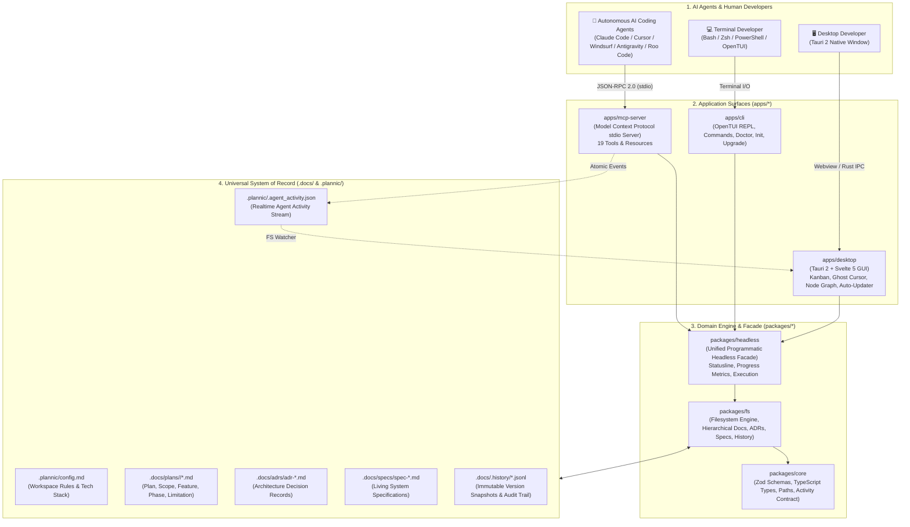
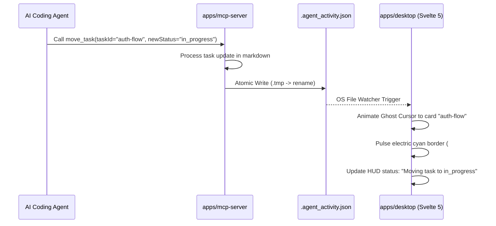

# 🏛️ Plannic System Architecture (`docs/architecture.md`)

> **Comprehensive Technical Architecture, Monorepo Topology, and Communication Protocols**

Plannic is engineered as a **local-first, multi-surface engineering workbench** where autonomous AI coding agents, terminal-centric developers, and visual desktop users collaborate simultaneously over a shared, Git-backed filesystem store in `.docs/`.

---

## 1. System Topology & Layering

Plannic is organized as a modular **Bun monorepo** divided into three clean tiers: **Storage**, **Libraries**, and **Application Surfaces**.



---

## 2. Package Responsibilities

### `packages/core` (Shared Contracts & Types)
- **Role**: Pure domain definitions with zero runtime dependencies (except Zod).
- **Key Responsibilities**:
  - Validates document frontmatter (`DocFrontmatterSchema`, `AdrFrontmatterSchema`, `SpecFrontmatterSchema`).
  - Defines workspace configuration contracts (`ProjectConfigFrontmatterSchema`, `RulesetConfigSchema`).
  - Standardizes MCP tool input and output schemas.
  - Defines the `AgentActivityEvent` contract used by the Ghost Cursor.

### `packages/fs` (Filesystem Engine & Markdown Serializer)
- **Role**: Handles all disk operations, Gray-Matter YAML extraction, and Markdown task regex manipulations.
- **Key Responsibilities**:
  - Hierarchical document CRUD (`readPlan`, `writePlan`, `updateDocument`).
  - ADR number generator and slug formatter (`initAdr`, `listAdrs`).
  - Living specifications manager (`initSpec`, `updateSpec`, `listSpecs`).
  - Kanban task state mutator (`moveTask` from `- [ ]` to `- [x]`).
  - Append-only audit logger writing to `.docs/.history/<slug>.jsonl`.
  - Atomic activity stream writer (`writeActivityEvent`).

### `packages/headless` (Unified Facade)
- **Role**: High-level facade aggregating `@plannic/core` and `@plannic/fs` into a unified programmatic interface.
- **Key Responsibilities**:
  - Ingests workspace context and exposes simplified methods for CLI, MCP, and tests.
  - Computes multi-phase progress metrics and completion percentages.
  - Formats persistent CLI statusline indicators (`[Plannic] │ plan-slug Ph1 (5/10) [■■■□□□] 50%`).
  - Renders inline terminal cards for non-intrusive status reports.

### `apps/mcp-server` (Model Context Protocol Gateway)
- **Role**: Standard JSON-RPC 2.0 stdio server connecting external LLMs to Plannic.
- **Key Responsibilities**:
  - Implements Model Context Protocol specification (`@modelcontextprotocol/sdk`).
  - Registers 19 tools for planning, phase advancement, task movement, ADR management, and living specs.
  - Broadcasts atomic activity events upon every tool invocation to power the desktop Ghost Cursor.

### `apps/desktop` (Tauri 2 + Svelte 5 Visual Workbench)
- **Role**: High-performance, zero-latency desktop application with strict `#0F1117` monochrome aesthetic.
- **Key Responsibilities**:
  - Interactive Kanban board with drag-and-drop task movement.
  - Realtime **Agent Ghost Cursor**: floats across cards and glows cyan when an agent runs MCP tools.
  - Milestone dependency node graph visualizing cross-phase delivery.
  - Built-in Markdown split-screen editor.
  - Cryptographically signed zero-touch auto-updater via `@tauri-apps/plugin-updater`.

### `apps/cli` (Unified OpenTUI Terminal Interface)
- **Role**: Single executable binary providing interactive TUI, headless JSON operations, and self-diagnosis.
- **Key Responsibilities**:
  - Interactive OpenTUI planning workspace with tab-autocomplete and command palette (`Ctrl+K`).
  - Direct headless commands (`plan list`, `plan search`, `plan create`).
  - Workspace diagnostics (`plannic doctor`, `plannic doctor --mcp`).
  - Safe workspace initializer (`plannic init`, `plannic init --diff`).

---

## 3. Communication Protocols

### 3.1 Model Context Protocol (stdio)
AI coding agents launch the Plannic MCP server as a subprocess communicating over `stdin` and `stdout`:
```text
AI Client (Claude Code / Antigravity / Cursor)
      │
      │ 1. Request: {"jsonrpc":"2.0","method":"tools/call","params":{"name":"move_task", ...}}
      ▼
Plannic MCP Server (apps/mcp-server)
      │
      │ 2. Mutate Markdown task via @plannic/fs
      ▼
Local Filesystem (.docs/plans/<slug>/phase-1.md)
```

### 3.2 Realtime Activity Bus (`.plannic/.agent_activity.json`)
To enable the desktop app to visually track AI agent operations without running a heavy WebSocket server or polling, Plannic uses a **file-based reactive event bus**:



### 3.3 Tauri 2 Native IPC
The desktop app frontend (Svelte 5) interacts with the host operating system via Tauri 2 Rust commands:
- High-performance asynchronous filesystem calls.
- Native OS folder picker dialogs (`@tauri-apps/plugin-dialog`).
- Cryptographically validated updates (`@tauri-apps/plugin-updater`).

---

## 4. Storage Architecture: Why Local Markdown?

Plannic intentionally rejects cloud databases, SQLite, and proprietary binary formats in favor of **Human-Readable Local Markdown in `.docs/`**:

1. **Context Window Efficiency**: LLMs understand Markdown natively. Raw Markdown files require zero schema translation, minimizing token overhead.
2. **Git Native**: Architecture decisions, specifications, and task progressions are version-controlled alongside application code. PRs review code changes and architecture changes in the exact same diff.
3. **Zero Vendor Lock-in**: If a developer uninstalls Plannic, their architecture blueprints, ADRs, and living specs remain 100% accessible in plain text.
4. **Conflict-Resistant Structure**: By dividing deep plans into modular sub-documents (`plan.md`, `scope.md`, `feature.md`, `phase-*.md`, `limitation.md`), multiple team members or parallel subagents can modify different aspects of an initiative without Git merge conflicts.
